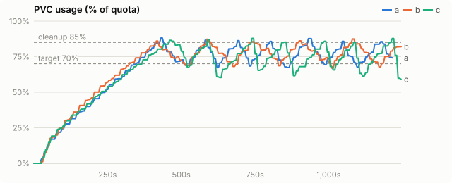
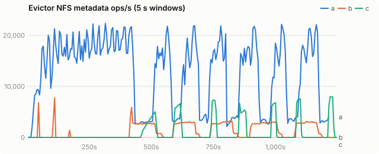
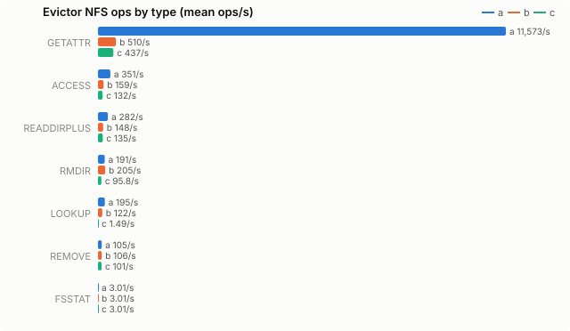
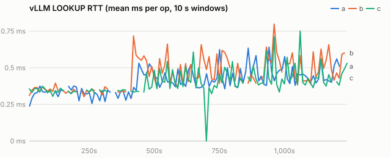
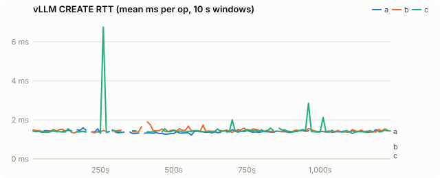
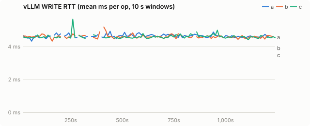
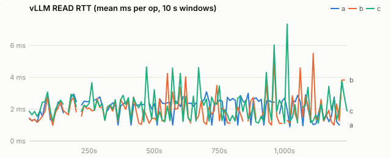
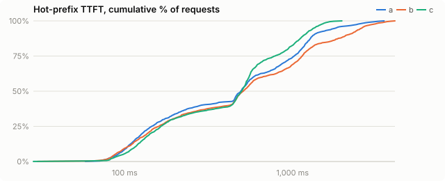

# PVC evictor A/B/C: vLLM 0.31 on VAST

| run | evictor image |
|---|---|
| a | `quay.io/wseaton/pvc-evictor:a-f62b9a7` |
| b | `quay.io/wseaton/pvc-evictor:b-2a03840` |
| c | `quay.io/wseaton/kvreap:c-af6f566` |

One 20-minute run per variant on coreweave-waldorf (1× H200, VAST), run back to back on 2026-10-09.

**a** is the current Python pvc_evictor (llm-d-kv-cache `main`), **b** the Python evictor with the quick fixes ([opendatahub-io/llm-d-kv-cache#35](https://github.com/opendatahub-io/llm-d-kv-cache/pull/35)), **c** kvreap (this repo).

All three ran with the chart defaults (cleanup 85%, target 70%, no rate cap) plus `fileAccessTimeThresholdMinutes: 2` so files become evictable within a short run.

## Findings

| | a | b | c |
|---|---|---|---|
| evictor NFS metadata ops/s (mean) | 12,700 | 1,254 | **905** |
| evictor metadata ops per deleted file | ~120 | ~12 | **~9** |
| median prune (85% → 70%) | 51 s | 91 s | **20 s** |
| hot-prefix TTFT p99 | 2,863 ms | 3,474 ms | **1,598 ms** |
| FS-tier hits | 66k | 61k | **95k** |
| vLLM promotion (load) failures | 174 | 139 | **64** |
| churn throughput (input tok/s) | 29.9k | 26.8k | **34.3k** |
| max usage | 88.1% | 87.4% | 87.9% |

- **Metadata load.** A's crawlers stat every file continuously, including while usage is below the cleanup threshold (15–22k ops/s for the first ~450 s), and average 5.7× vLLM's own metadata traffic over the run. B removes the idle crawl (10× fewer ops). C issues about 28% fewer ops than B and nothing but `statvfs` (3/s) while idle.
- **Eviction quality.** C evicts approximately oldest-first; A and B delete whatever the crawl finds first. With C, more of the repeatedly read prefixes stay on disk: 43% more FS-tier hits, a p99 TTFT 44–54% lower than A/B, and fewer failed promotions (vLLM reading a block the evictor just deleted).
- **Prune speed.** C clears 85% → 70% in 20 s against 51 s (A) and 91 s (B, whose single deleter stats and unlinks serially). C's deletions are bursty: its op budget ramps to several thousand ops/s because VAST latency never rose enough to trigger the AIMD back-off. Set `DELETION_MAX_FILES_PER_SECOND` to cap the peak.
- **vLLM NFS latency** barely moves with any evictor on a single PVC: VAST absorbs the load. LOOKUP RTT while deleting vs. idle rises 18% (a), 22% (b) and 5% (c); CREATE, WRITE and GETATTR are flat.

## Caveats

- n = 1 per variant. A was run twice and matched within ~5% on evictor ops and prune time.
- One vLLM replica on one PVC. Contention on a busier VAST or with many replicas sharing the PVC is untested.
- VAST is mounted `noatime` and vLLM 0.31 never refreshes atime on cache hits, so "hot" means "recently written" for every variant.
- The PVCs use a clone of `shared-vast` with `nosharecache`, so each pod's NFS counters are its own; see `bench/README.md`.

## Setup

| setting | value |
|---|---|
| model | Qwen/Qwen3-0.6B |
| vLLM image | docker.io/vllm/vllm-openai:v0.31.0 |
| PVC size | 100Gi |
| storage class | kvreap-bench-vast |
| load duration (s) | 1200 |
| offload block (tokens) | 16 |
| CPU tier (bytes) | 2147483648 |
| GPU KV blocks | 4096 |
| churn prompt length | 4096 |
| churn concurrency | 8 |
| hot prefixes | 64 |
| hot prefix length | 2048 |
| hot request rate (req/s) | 2.0 |

Time axes are seconds since the load generator started.

## PVC usage

<picture><source media="(prefers-color-scheme: dark)" srcset="charts/usage-dark.svg"></picture>

## Evictor metadata load

<picture><source media="(prefers-color-scheme: dark)" srcset="charts/evictor-ops-dark.svg"></picture>

## Evictor ops by type

<picture><source media="(prefers-color-scheme: dark)" srcset="charts/evictor-op-types-dark.svg"></picture>

## vLLM LOOKUP latency

<picture><source media="(prefers-color-scheme: dark)" srcset="charts/rtt-lookup-dark.svg"></picture>

## vLLM CREATE latency

<picture><source media="(prefers-color-scheme: dark)" srcset="charts/rtt-create-dark.svg"></picture>

## vLLM WRITE latency

<picture><source media="(prefers-color-scheme: dark)" srcset="charts/rtt-write-dark.svg"></picture>

## vLLM READ latency

<picture><source media="(prefers-color-scheme: dark)" srcset="charts/rtt-read-dark.svg"></picture>

## Hot-prefix TTFT

<picture><source media="(prefers-color-scheme: dark)" srcset="charts/ttft-dark.svg"></picture>

## All metrics

| metric | a | b | c |
|---|---|---|---|
| load duration (s) | 1,220 | 1,250 | 1,249 |
| **evictor metadata ops/s (mean)** | 12,699.9 | 1,253.5 | 904.7 |
| evictor metadata ops (total) | 15,481,134 | 1,565,574 | 1,129,089 |
| evictor ACCESS/s (mean / p95 10s) | 350.6 / 973.0 | 159.4 / 384.5 | 132.1 / 899.6 |
| evictor FSINFO/s (mean / p95 10s) | 0.0 / 0.0 | 0.0 / 0.0 | 0.0 / 0.0 |
| evictor FSSTAT/s (mean / p95 10s) | 3.0 / 3.1 | 3.0 / 3.1 | 3.0 / 3.1 |
| evictor GETATTR/s (mean / p95 10s) | 11,573.3 / 20,985.2 | 510.2 / 1,328.5 | 436.6 / 3,067.5 |
| evictor LOOKUP/s (mean / p95 10s) | 195.2 / 1,024.5 | 122.4 / 338.0 | 1.5 / 9.8 |
| evictor NULL/s (mean / p95 10s) | 0.0 / 0.0 | 0.0 / 0.0 | 0.0 / 0.0 |
| evictor PATHCONF/s (mean / p95 10s) | 0.0 / 0.0 | 0.0 / 0.0 | 0.0 / 0.0 |
| evictor READDIRPLUS/s (mean / p95 10s) | 281.5 / 759.5 | 147.6 / 364.6 | 135.2 / 927.9 |
| evictor REMOVE/s (mean / p95 10s) | 105.2 / 387.4 | 105.9 / 286.8 | 100.6 / 708.3 |
| evictor RMDIR/s (mean / p95 10s) | 191.1 / 441.1 | 205.0 / 474.4 | 95.8 / 676.3 |
| vLLM LOOKUP RTT ms (all) | 0.40 | 0.43 | 0.38 |
| vLLM LOOKUP RTT ms (deleting / idle) | 0.45 / 0.38 | 0.49 / 0.40 | 0.40 / 0.38 |
| vLLM GETATTR RTT ms (all) | 0.40 | 0.38 | 0.38 |
| vLLM GETATTR RTT ms (deleting / idle) | 0.39 / 0.41 | 0.37 / 0.38 | 0.37 / 0.38 |
| vLLM CREATE RTT ms (all) | 1.38 | 1.43 | 1.40 |
| vLLM CREATE RTT ms (deleting / idle) | 1.37 / 1.38 | 1.43 / 1.43 | 1.42 / 1.40 |
| vLLM RENAME RTT ms (all) | 2.21 | 2.26 | 2.22 |
| vLLM RENAME RTT ms (deleting / idle) | 2.20 / 2.21 | 2.26 / 2.26 | 2.22 / 2.22 |
| vLLM WRITE RTT ms (all) | 4.63 | 4.61 | 4.59 |
| vLLM WRITE RTT ms (deleting / idle) | 4.64 / 4.63 | 4.61 / 4.62 | 4.60 / 4.59 |
| vLLM READ RTT ms (all) | 2.22 | 1.83 | 2.14 |
| vLLM READ RTT ms (deleting / idle) | 2.02 / 2.25 | 1.50 / 1.96 | 1.95 / 2.16 |
| vLLM metadata ops/s | 2,210.1 | 2,479.2 | 2,312.5 |
| prune cycles | 7 | 5 | 7 |
| prune seconds (median) | 50.6 | 90.7 | 20.0 |
| max usage % | 88.1 | 87.4 | 87.9 |
| % time >= cleanup threshold | 5.9 | 4.8 | 6.4 |
| hot ttft p50 ms | 492.2 | 509.5 | 498.5 |
| hot ttft p90 ms | 1,342.2 | 2,123.6 | 1,179.6 |
| hot ttft p99 ms | 2,863.4 | 3,474.5 | 1,597.7 |
| hot requests (failed) | 1,536 (0) | 1,600 (0) | 1,600 (0) |
| churn input tok/s | 29,853 | 26,750 | 34,324 |
| vLLM log: quota_exceeded | 0 | 0 | 0 |
| vLLM log: store_failed | 0 | 0 | 0 |
| vLLM log: load_failed | 174 | 140 | 64 |
| `vllm:external_prefix_cache_hits_total{engine="0",model_name="Qwen/Qwen3-0.6B"}` Δ | 947,616 | 878,944 | 1,405,184 |
| `vllm:external_prefix_cache_queries_total{engine="0",model_name="Qwen/Qwen3-0.6B"}` Δ | 14,991,384 | 15,124,505 | 15,910,937 |
| `vllm:kv_offload_allocation_failure_total{engine="0",model_name="Qwen/Qwen3-0.6B"}` Δ | 23,866 | 23,666 | 25,637 |
| `vllm:kv_offload_load_bytes_total{engine="0",model_name="Qwen/Qwen3-0.6B"}` Δ | 108,680,183,808 | 100,804,329,472 | 161,157,742,592 |
| `vllm:kv_offload_load_time_total{engine="0",model_name="Qwen/Qwen3-0.6B"}` Δ | 3 | 3 | 4 |
| `vllm:kv_offload_store_bytes_total{engine="0",model_name="Qwen/Qwen3-0.6B"}` Δ | 457,617,965,056 | 493,459,341,312 | 408,694,816,768 |
| `vllm:kv_offload_store_time_total{engine="0",model_name="Qwen/Qwen3-0.6B"}` Δ | 13 | 14 | 11 |
| `vllm:kv_offload_tiering_cascade_job_failures_total{engine="0",model_name="Qwen/Qwen3-0.6B",tier="1:fs"}` Δ | - | 1 | - |
| `vllm:kv_offload_tiering_chunk_hits_total{engine="0",model_name="Qwen/Qwen3-0.6B",tier="1:fs"}` Δ | 66,364 | 60,593 | 95,072 |
| `vllm:kv_offload_tiering_chunk_queries_total{engine="0",model_name="Qwen/Qwen3-0.6B",tier="0:primary"}` Δ | 936,960 | 945,280 | 994,432 |
| `vllm:kv_offload_tiering_chunk_queries_total{engine="0",model_name="Qwen/Qwen3-0.6B",tier="1:fs"}` Δ | 70,301 | 64,618 | 99,014 |
| `vllm:kv_offload_tiering_promotion_allocation_failures_total{engine="0",model_name="Qwen/Qwen3-0.6B"}` Δ | 1,774 | 1,577 | 2,687 |
| `vllm:kv_offload_tiering_promotion_job_failures_total{engine="0",model_name="Qwen/Qwen3-0.6B",tier="1:fs"}` Δ | 174 | 139 | 64 |
| `vllm:kv_offload_tiering_read_bytes_total{engine="0",model_name="Qwen/Qwen3-0.6B",tier="1:fs"}` Δ | 117,864,398,848 | 111,680,421,888 | 174,995,537,920 |
| `vllm:kv_offload_tiering_read_time_total{engine="0",model_name="Qwen/Qwen3-0.6B",tier="1:fs"}` Δ | 228 | 232 | 371 |
| `vllm:kv_offload_tiering_write_bytes_total{engine="0",model_name="Qwen/Qwen3-0.6B",tier="1:fs"}` Δ | 457,617,965,056 | 493,222,625,280 | 408,694,816,768 |
| `vllm:kv_offload_tiering_write_time_total{engine="0",model_name="Qwen/Qwen3-0.6B",tier="1:fs"}` Δ | 2,145 | 2,327 | 2,036 |
| `vllm:kv_offload_total_bytes_total{engine="0",model_name="Qwen/Qwen3-0.6B",transfer_type="CPU_to_GPU"}` Δ | 108,680,183,808 | 100,804,329,472 | 161,157,742,592 |
| `vllm:kv_offload_total_bytes_total{engine="0",model_name="Qwen/Qwen3-0.6B",transfer_type="GPU_to_CPU"}` Δ | 457,617,965,056 | 493,459,341,312 | 408,694,816,768 |
| `vllm:kv_offload_total_time_total{engine="0",model_name="Qwen/Qwen3-0.6B",transfer_type="CPU_to_GPU"}` Δ | 3 | 3 | 4 |
| `vllm:kv_offload_total_time_total{engine="0",model_name="Qwen/Qwen3-0.6B",transfer_type="GPU_to_CPU"}` Δ | 13 | 14 | 11 |
| `vllm:prefix_cache_queries_total{engine="0",model_name="Qwen/Qwen3-0.6B"}` Δ | 14,991,384 | 15,124,505 | 15,910,937 |
