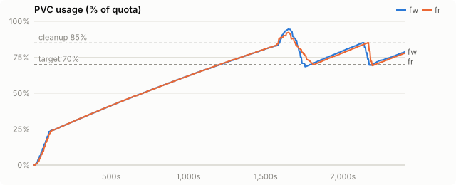
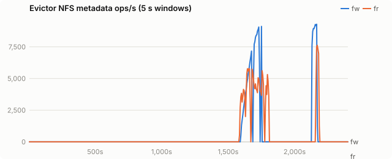
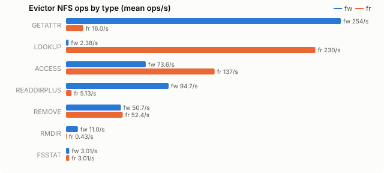
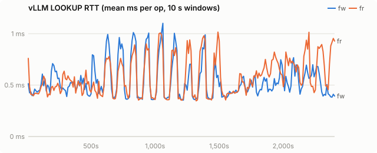
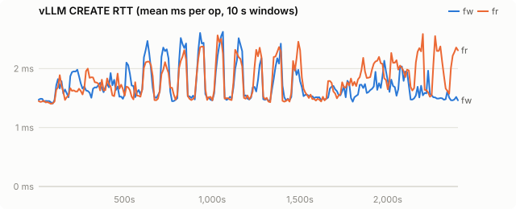
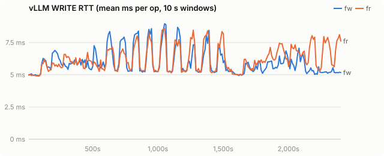
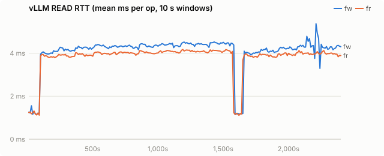
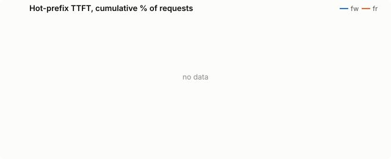

# Chain-aware eviction at scale: Qwen2.5-72B TP=4 on VAST

| run | evictor image |
|---|---|
| fw | `quay.io/wseaton/kvreap:r-b5a0097` |
| fr | `quay.io/wseaton/kvreap:r-b5a0097` |

Final check at a larger scale: Qwen/Qwen2.5-72B-Instruct, TP=4, `--kv-cache-dtype fp8`, 4× H200 per run, fs tier on VAST through the striped tier plugin. Same nyann-bench `conversation_pool` agent load as the 32B runs, scaled up: 96 sessions in rotation, 8 in flight, 2,048-token shared preamble, 8,000-token first turn, up to 30 turns of 500 tokens with 200-token replies. 40 minutes per run, 500Gi PVC, CPU tier 32 GiB. **fw** and **fr** ran at the same time on separate GPUs and PVCs, same kvreap image (`r-b5a0097`), differing only in `CHAIN_EVICTION` (`observe` = plain sampled LRU, `radix`).

## Findings

| | fw (plain LRU) | fr (radix) | fr vs fw |
|---|---|---|---|
| requests completed in 40 min | 4,330 | **4,495** | +3.8% |
| prefix tokens served from the offload tiers | 65.7M of 71.1M (92.4%) | **69.7M of 74.3M (93.8%)** | +6.0% |
| returning-turn TTFT p50 | 693 ms | 667 ms | −4% |
| returning-turn TTFT p90 | 1,101 ms | **937 ms** | −15% |
| returning-turn TTFT p99 | 3,340 ms | **1,257 ms** | 2.7× lower |
| first-turn TTFT p90 | 2,974 ms | 3,669 ms | +23% |
| KV rewritten to the fs tier | 884 GB | **749 GB** | −15% |
| deletions that cut a live chain (internal) | 57,034 | **56** | 1,000× fewer |
| dead tails deleted later (orphans) | 43,038 | 56 | |

- **Same direction as 32B, smaller margin.** The 500Gi PVC held most of the working set: each run pruned twice in 40 minutes, against 8 (plain) and 12 (radix) on 32B. With little pressure, plain LRU cut fewer sessions that mattered, so the gain is in the tail (p99 3.3 s to 1.3 s) more than in throughput.
- **Chains stay whole.** Plain LRU cut 57k live chains; radix cut 56 and deleted 125,750 blocks as whole leaf edges instead.
- **First-turn TTFT is worse under radix.** First turns are 8k-token prefills that hit only the shared preamble, so eviction should not touch them. The likely cause is radix serving more returning turns, which leaves more prefill work queued against first turns at the same concurrency. One run per policy cannot separate that from noise.
- **Image.** `r-b5a0097` predates the change that orders radix edges by their newest write. These runs order candidates by file age and protect edges written within the hot threshold, as the 32B runs did.

## Setup

| setting | value |
|---|---|
| model | Qwen/Qwen2.5-72B-Instruct |
| vLLM image | docker.io/vllm/vllm-openai:v0.31.0 |
| PVC size | 500Gi |
| storage class | kvreap-bench-vast |
| load duration (s) | 2400 |
| offload block (tokens) | 16 |
| CPU tier (bytes) | 34359738368 |
| GPU KV blocks | 16384 |
| churn prompt length | 4096 |
| churn concurrency | 8 |
| hot prefixes | 64 |
| hot prefix length | 2048 |
| hot request rate (req/s) | 2.0 |

Time axes are seconds since the load generator started.

## PVC usage

<picture><source media="(prefers-color-scheme: dark)" srcset="chain-spike-72b/charts/usage-dark.svg"></picture>

## Evictor metadata load

<picture><source media="(prefers-color-scheme: dark)" srcset="chain-spike-72b/charts/evictor-ops-dark.svg"></picture>

## Evictor ops by type

<picture><source media="(prefers-color-scheme: dark)" srcset="chain-spike-72b/charts/evictor-op-types-dark.svg"></picture>

## vLLM LOOKUP latency

<picture><source media="(prefers-color-scheme: dark)" srcset="chain-spike-72b/charts/rtt-lookup-dark.svg"></picture>

## vLLM CREATE latency

<picture><source media="(prefers-color-scheme: dark)" srcset="chain-spike-72b/charts/rtt-create-dark.svg"></picture>

## vLLM WRITE latency

<picture><source media="(prefers-color-scheme: dark)" srcset="chain-spike-72b/charts/rtt-write-dark.svg"></picture>

## vLLM READ latency

<picture><source media="(prefers-color-scheme: dark)" srcset="chain-spike-72b/charts/rtt-read-dark.svg"></picture>

## Hot-prefix TTFT

<picture><source media="(prefers-color-scheme: dark)" srcset="chain-spike-72b/charts/ttft-dark.svg"></picture>

## All metrics

| metric | fw | fr |
|---|---|---|
| load duration (s) | 2,405 | 2,405 |
| **evictor metadata ops/s (mean)** | 489.0 | 444.2 |
| evictor metadata ops (total) | 1,175,457 | 1,067,945 |
| evictor ACCESS/s (mean / p95 10s) | 73.6 / 762.4 | 137.1 / 1,245.8 |
| evictor CREATE/s (mean / p95 10s) | 0.0 / 0.0 | 0.0 / 0.0 |
| evictor FSINFO/s (mean / p95 10s) | 0.0 / 0.0 | 0.0 / 0.0 |
| evictor FSSTAT/s (mean / p95 10s) | 3.0 / 3.1 | 3.0 / 3.1 |
| evictor GETATTR/s (mean / p95 10s) | 253.6 / 2,116.3 | 16.0 / 124.4 |
| evictor LOOKUP/s (mean / p95 10s) | 2.4 / 5.4 | 230.2 / 2,353.3 |
| evictor NULL/s (mean / p95 10s) | 0.0 / 0.0 | 0.0 / 0.0 |
| evictor PATHCONF/s (mean / p95 10s) | 0.0 / 0.0 | 0.0 / 0.0 |
| evictor READ/s (mean / p95 10s) | 0.0 / 0.0 | 0.0 / 0.0 |
| evictor READDIRPLUS/s (mean / p95 10s) | 94.7 / 919.3 | 5.1 / 40.3 |
| evictor REMOVE/s (mean / p95 10s) | 50.7 / 485.5 | 52.4 / 397.8 |
| evictor RMDIR/s (mean / p95 10s) | 11.0 / 0.0 | 0.4 / 0.2 |
| evictor SETATTR/s (mean / p95 10s) | 0.0 / 0.0 | 0.0 / 0.0 |
| evictor WRITE/s (mean / p95 10s) | 0.0 / 0.0 | 0.0 / 0.0 |
| vLLM LOOKUP RTT ms (all) | 0.52 | 0.54 |
| vLLM LOOKUP RTT ms (deleting / idle) | 0.46 / 0.53 | 0.48 / 0.55 |
| vLLM GETATTR RTT ms (all) | 1.34 | 1.19 |
| vLLM GETATTR RTT ms (deleting / idle) | 1.02 / 1.35 | 1.08 / 1.20 |
| vLLM CREATE RTT ms (all) | 1.65 | 1.70 |
| vLLM CREATE RTT ms (deleting / idle) | 1.52 / 1.68 | 1.57 / 1.74 |
| vLLM RENAME RTT ms (all) | 2.62 | 2.69 |
| vLLM RENAME RTT ms (deleting / idle) | 2.51 / 2.65 | 2.56 / 2.72 |
| vLLM WRITE RTT ms (all) | 5.69 | 5.88 |
| vLLM WRITE RTT ms (deleting / idle) | 5.12 / 5.81 | 5.37 / 6.01 |
| vLLM READ RTT ms (all) | 4.30 | 4.00 |
| vLLM READ RTT ms (deleting / idle) | 4.05 / 4.31 | 3.88 / 4.01 |
| vLLM LOOKUP client queue ms | 0.004 | 0.004 |
| vLLM GETATTR client queue ms | 0.005 | 0.005 |
| vLLM CREATE client queue ms | 0.003 | 0.003 |
| vLLM RENAME client queue ms | 0.013 | 0.013 |
| vLLM WRITE client queue ms | 0.194 | 0.197 |
| vLLM READ client queue ms | 0.016 | 0.018 |
| vLLM FS read s/GiB | 3.08 | 2.85 |
| vLLM FS write s/GiB | 5.61 | 6.99 |
| vLLM metadata ops/s | 4,008.4 | 4,117.7 |
| prune cycles | 2 | 2 |
| prune seconds (median) | 100.4 | 125.9 |
| max usage % | 94.5 | 92.2 |
| % time >= cleanup threshold | 5.0 | 5.0 |
| hot ttft p50 ms | - | - |
| hot ttft p90 ms | - | - |
| hot ttft p99 ms | - | - |
| agent requests | 4,330 | 4,495 |
| agent failed | 0 | 0 |
| agent first ttft p50 ms | 1,669.6 | 1,825.1 |
| agent first ttft p90 ms | 2,974.1 | 3,668.9 |
| agent later ttft p50 ms | 692.6 | 666.5 |
| agent later ttft p90 ms | 1,100.5 | 937.0 |
| agent later ttft p99 ms | 3,339.9 | 1,256.8 |
| agent prompt tok per s | - | - |
| hot requests (failed) | - (-) | - (-) |
| churn input tok/s | - | - |
| vLLM log: quota_exceeded | 0 | 0 |
| vLLM log: store_failed | 0 | 0 |
| vLLM log: load_failed | 3 | 0 |
| chain deletions: heads (root + orphan) | 43,038 | 56 |
| chain deletions: root | 0 | 0 |
| chain deletions: orphan (parent gone) | 43,038 | 56 |
| chain deletions: internal | 57,034 | 56 |
| chain deletions: leaf | 21,769 | 125,750 |
| chain deletions: untracked | 0 | 0 |
| chain deferrals | 0 | 0 |
| chain deletions: cascaded below a deleted root | 0 | 125,798 |
| blocks announced without a digest | 0 | 0 |
| leaf edges skipped as too young | 0 | 3,439 |
| young leaf edges deleted under pressure | 0 | 25 |
| KV event batches received | 57,749 | 59,381 |
| KV event decode errors | 0 | 0 |
| `vllm:external_prefix_cache_hits_total{engine="0",model_name="Qwen/Qwen2.5-72B-Instruct"}` Δ | 65,712,576 | 69,682,032 |
| `vllm:external_prefix_cache_queries_total{engine="0",model_name="Qwen/Qwen2.5-72B-Instruct"}` Δ | 71,132,970 | 74,279,283 |
| `vllm:kv_offload_load_bytes_total{engine="0",model_name="Qwen/Qwen2.5-72B-Instruct"}` Δ | 10,766,348,451,840 | 11,416,704,122,880 |
| `vllm:kv_offload_load_time_total{engine="0",model_name="Qwen/Qwen2.5-72B-Instruct"}` Δ | 398 | 512 |
| `vllm:kv_offload_store_bytes_total{engine="0",model_name="Qwen/Qwen2.5-72B-Instruct"}` Δ | 883,063,521,280 | 747,655,659,520 |
| `vllm:kv_offload_store_time_total{engine="0",model_name="Qwen/Qwen2.5-72B-Instruct"}` Δ | 31 | 45 |
| `vllm:kv_offload_tiering_chunk_hits_total{engine="0",model_name="Qwen/Qwen2.5-72B-Instruct",tier="1:StripedFileSystemTierManager"}` Δ | 4,108,877 | 4,355,127 |
| `vllm:kv_offload_tiering_chunk_queries_total{engine="0",model_name="Qwen/Qwen2.5-72B-Instruct",tier="0:primary"}` Δ | 4,446,018 | 4,641,489 |
| `vllm:kv_offload_tiering_chunk_queries_total{engine="0",model_name="Qwen/Qwen2.5-72B-Instruct",tier="1:StripedFileSystemTierManager"}` Δ | 4,113,212 | 4,359,628 |
| `vllm:kv_offload_tiering_promotion_job_failures_total{engine="0",model_name="Qwen/Qwen2.5-72B-Instruct",tier="1:StripedFileSystemTierManager"}` Δ | 3 | - |
| `vllm:kv_offload_tiering_read_bytes_total{engine="0",model_name="Qwen/Qwen2.5-72B-Instruct",tier="1:StripedFileSystemTierManager"}` Δ | 10,769,268,736,000 | 11,416,704,122,880 |
| `vllm:kv_offload_tiering_read_time_total{engine="0",model_name="Qwen/Qwen2.5-72B-Instruct",tier="1:StripedFileSystemTierManager"}` Δ | 30,859 | 30,279 |
| `vllm:kv_offload_tiering_write_bytes_total{engine="0",model_name="Qwen/Qwen2.5-72B-Instruct",tier="1:StripedFileSystemTierManager"}` Δ | 884,371,619,840 | 748,997,836,800 |
| `vllm:kv_offload_tiering_write_time_total{engine="0",model_name="Qwen/Qwen2.5-72B-Instruct",tier="1:StripedFileSystemTierManager"}` Δ | 4,618 | 4,874 |
| `vllm:kv_offload_total_bytes_total{engine="0",model_name="Qwen/Qwen2.5-72B-Instruct",transfer_type="CPU_to_GPU"}` Δ | 10,766,348,451,840 | 11,416,704,122,880 |
| `vllm:kv_offload_total_bytes_total{engine="0",model_name="Qwen/Qwen2.5-72B-Instruct",transfer_type="GPU_to_CPU"}` Δ | 883,063,521,280 | 747,655,659,520 |
| `vllm:kv_offload_total_time_total{engine="0",model_name="Qwen/Qwen2.5-72B-Instruct",transfer_type="CPU_to_GPU"}` Δ | 398 | 512 |
| `vllm:kv_offload_total_time_total{engine="0",model_name="Qwen/Qwen2.5-72B-Instruct",transfer_type="GPU_to_CPU"}` Δ | 31 | 45 |
| `vllm:prefix_cache_hits_total{engine="0",model_name="Qwen/Qwen2.5-72B-Instruct"}` Δ | 6,726,368 | 6,985,552 |
| `vllm:prefix_cache_queries_total{engine="0",model_name="Qwen/Qwen2.5-72B-Instruct"}` Δ | 77,859,338 | 81,264,835 |
