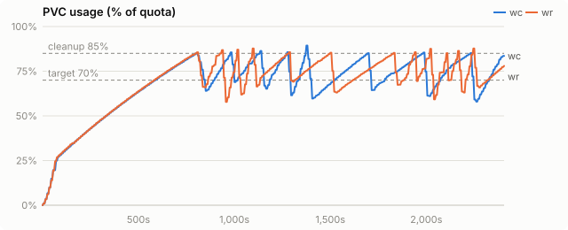
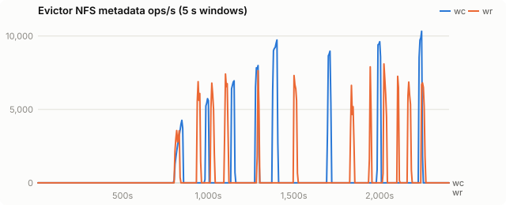
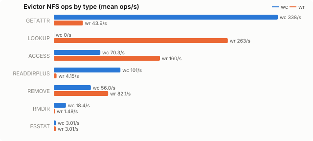
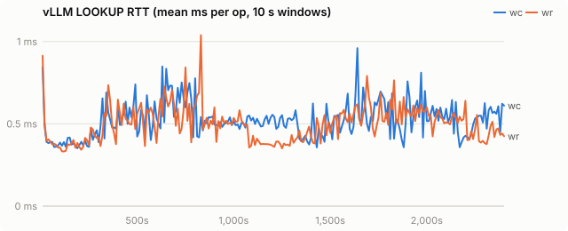
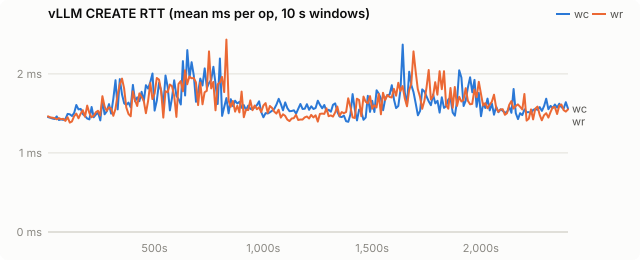
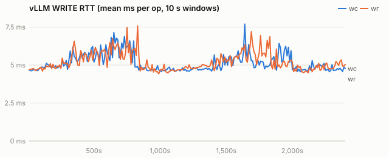
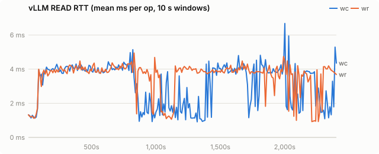
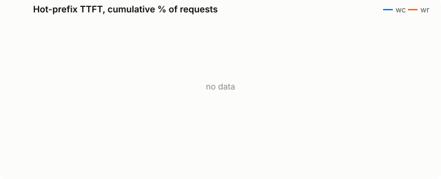

# Chain-aware eviction on an agentic workload: Qwen3-32B on VAST

| run | evictor image |
|---|---|
| wc | `quay.io/wseaton/kvreap:r-c209808` |
| wr | `quay.io/wseaton/kvreap:r-c209808` |

Agentic workload on coreweave-waldorf: Qwen/Qwen3-32B, TP=1, `--kv-cache-dtype fp8`, 1× H200 per run, fs tier on VAST through the striped tier plugin (`bench/vllm_plugins/striped_fs.py`). Load is nyann-bench `edd5f54` in `conversation_pool` mode: 32 sessions in rotation, 8 requests in flight, each session a shared 2,048-token agent preamble, an 8,000-token first turn, then up to 30 turns of 500 new tokens with 200-token replies (prompts reach ~31k tokens). 40 minutes per run, 120Gi PVC, CPU tier 32 GiB, 16,384 GPU blocks. **wc** and **wr** ran at the same time on separate GPUs and PVCs, same kvreap image (`r-c209808`), differing only in `CHAIN_EVICTION` (`observe` = plain sampled LRU, `radix`).

Sessions live ~15 minutes and the PVC holds ~6 minutes of KV writes, so the evictor has to choose between live and finished sessions.

## Findings

Radix eviction wins on throughput and tail latency:

| | wc (plain LRU) | wr (radix) | wr vs wc |
|---|---|---|---|
| requests completed in 40 min | 1,739 | **2,139** | +23% |
| prefix tokens served from the offload tiers | 23.0M of 30.2M (76%) | **32.6M of 37.2M (88%)** | +41% |
| returning-turn TTFT p50 | 847 ms | 864 ms | same |
| returning-turn TTFT p90 | 6,604 ms | **1,796 ms** | 3.7× lower |
| returning-turn TTFT p99 | 27,365 ms | **18,035 ms** | −34% |
| first-turn TTFT p90 | 7,740 ms | 6,861 ms | −11% |
| KV rewritten to the fs tier | 934 GB | **608 GB** | −35% |
| deletions that cut a live chain (internal) | 71,756 | **623** | 115× fewer |
| dead tails deleted later (orphans) | 41,811 | 119 | |
| whole unshared tails deleted (leaf edges) | 21,044 leaf | 196,807 leaf + 197,340 below | |

- **Why.** Plain LRU deletes by write time, so it deletes the oldest blocks of sessions that are still running: their preamble-adjacent context written at turn 0. A prefix lookup stops at the first missing block, so every later turn of a cut session recomputes from the cut, and the recomputed blocks are written again (+326 GB of writes). Radix ages each radix-tree leaf edge by the newest write in it, which is the session's last turn, so idle and finished sessions go first and live sessions keep their whole chain; a prefix shared by several sessions is never deleted while two of them still have blocks on disk.
- **Where it shows.** The median returning turn is the same in both runs (most turns hit either way); the tail is where cut sessions land. p90 drops from 6.6 s to 1.8 s, and the GPU time no longer spent recomputing turns into 23% more completed requests.

## The fs tier read path had to be fixed first

vLLM 0.31's fs tier submits a request's whole promotion as one thread-pool task, so one thread reads ~1,250 files one after another: ~0.57 GB/s per load, while the same VAST mount delivers 16 GB/s to 64 parallel readers. At that rate reading a 20k-token prefix back (2.6 GB fp8) was slower than recomputing it and no eviction policy could help. `StripedFileSystemTierManager` splits each load and store into one task per stripe (at most one per pool thread) and keeps upstream's keep-the-prefix-on-failure semantics; it loads through the tier factory's `module_path`, with no vLLM rebuild. Same 32-session workload, no eviction, 10 minutes:

| | stock fs tier | striped fs tier |
|---|---|---|
| returning-turn TTFT p50 / p90 / p99 | 5,651 / 6,612 / 8,258 ms | **857 / 1,288 / 1,683 ms** |
| first-turn TTFT p50 / p90 | 4,824 / 13,246 ms | 4,080 / 6,829 ms |
| requests completed | 349 | 500 |

A hit beats recompute when fs-tier read bandwidth exceeds `prefill_tokens_per_s × kv_bytes_per_token` (~0.8 GB/s here); the striped tier puts it well past that, which is what lets eviction quality show up in TTFT.

## Caveats

- n = 1 per policy; wc and wr ran concurrently on the same VAST cluster, so they saw the same storage conditions.
- nyann-bench's conversation pool resumes the least recently used conversation, a cyclic order. With a working set well above the PVC that pattern defeats every LRU-like policy (an earlier run with 64 sessions on 100Gi got ~0 fs hits under both); the sizing here keeps live sessions below capacity and finished sessions above it.
- Radix holds back edges with a block younger than the hot threshold; when the oldest candidates only map to young edges and a round is short of its quota it deletes them least recently written first (139 such edges in wr).
- The striped tier reports `read_time_total` as thread-seconds, so its fs `s/GiB` row is not comparable to the stock tier's.
- vLLM 0.31 sends 64-bit int block hashes by default; kvbench sets `VLLM_KV_EVENTS_USE_INT_BLOCK_HASHES=0` so radix and subtree eviction can name files from events, and turns on the fs tier's own `STORAGE` events so the index tracks what is on disk.

## Setup

| setting | value |
|---|---|
| model | Qwen/Qwen3-32B |
| vLLM image | docker.io/vllm/vllm-openai:v0.31.0 |
| PVC size | 120Gi |
| storage class | kvreap-bench-vast |
| load duration (s) | 2400 |
| offload block (tokens) | 16 |
| CPU tier (bytes) | 34359738368 |
| GPU KV blocks | 16384 |
| churn prompt length | 4096 |
| churn concurrency | 8 |
| hot prefixes | 64 |
| hot prefix length | 2048 |
| hot request rate (req/s) | 2.0 |

Time axes are seconds since the load generator started.

## PVC usage

<picture><source media="(prefers-color-scheme: dark)" srcset="chain-spike-agent/charts/usage-dark.svg"></picture>

## Evictor metadata load

<picture><source media="(prefers-color-scheme: dark)" srcset="chain-spike-agent/charts/evictor-ops-dark.svg"></picture>

## Evictor ops by type

<picture><source media="(prefers-color-scheme: dark)" srcset="chain-spike-agent/charts/evictor-op-types-dark.svg"></picture>

## vLLM LOOKUP latency

<picture><source media="(prefers-color-scheme: dark)" srcset="chain-spike-agent/charts/rtt-lookup-dark.svg"></picture>

## vLLM CREATE latency

<picture><source media="(prefers-color-scheme: dark)" srcset="chain-spike-agent/charts/rtt-create-dark.svg"></picture>

## vLLM WRITE latency

<picture><source media="(prefers-color-scheme: dark)" srcset="chain-spike-agent/charts/rtt-write-dark.svg"></picture>

## vLLM READ latency

<picture><source media="(prefers-color-scheme: dark)" srcset="chain-spike-agent/charts/rtt-read-dark.svg"></picture>

## Hot-prefix TTFT

<picture><source media="(prefers-color-scheme: dark)" srcset="chain-spike-agent/charts/ttft-dark.svg"></picture>

## All metrics

| metric | wc | wr |
|---|---|---|
| load duration (s) | 2,407 | 2,407 |
| **evictor metadata ops/s (mean)** | 586.4 | 557.6 |
| evictor metadata ops (total) | 1,410,859 | 1,341,675 |
| evictor ACCESS/s (mean / p95 10s) | 70.3 / 668.2 | 160.3 / 1,693.3 |
| evictor CREATE/s (mean / p95 10s) | 0.0 / 0.0 | 0.0 / 0.0 |
| evictor FSINFO/s (mean / p95 10s) | 0.0 / 0.0 | 0.0 / 0.0 |
| evictor FSSTAT/s (mean / p95 10s) | 3.0 / 3.1 | 3.0 / 3.1 |
| evictor GETATTR/s (mean / p95 10s) | 338.2 / 3,116.9 | 43.9 / 359.2 |
| evictor LOOKUP/s (mean / p95 10s) | 0.0 / 0.0 | 262.7 / 2,571.8 |
| evictor NULL/s (mean / p95 10s) | 0.0 / 0.0 | 0.0 / 0.0 |
| evictor PATHCONF/s (mean / p95 10s) | 0.0 / 0.0 | 0.0 / 0.0 |
| evictor READ/s (mean / p95 10s) | 0.0 / 0.0 | 0.0 / 0.0 |
| evictor READDIRPLUS/s (mean / p95 10s) | 100.6 / 971.5 | 4.1 / 29.0 |
| evictor REMOVE/s (mean / p95 10s) | 56.0 / 555.7 | 82.1 / 776.2 |
| evictor RMDIR/s (mean / p95 10s) | 18.4 / 42.8 | 1.5 / 12.3 |
| evictor SETATTR/s (mean / p95 10s) | 0.0 / 0.0 | 0.0 / 0.0 |
| evictor WRITE/s (mean / p95 10s) | 0.0 / 0.0 | 0.0 / 0.0 |
| vLLM LOOKUP RTT ms (all) | 0.52 | 0.50 |
| vLLM LOOKUP RTT ms (deleting / idle) | 0.48 / 0.52 | 0.51 / 0.50 |
| vLLM GETATTR RTT ms (all) | 1.00 | 1.01 |
| vLLM GETATTR RTT ms (deleting / idle) | 0.46 / 1.01 | 0.98 / 1.01 |
| vLLM CREATE RTT ms (all) | 1.59 | 1.60 |
| vLLM CREATE RTT ms (deleting / idle) | 1.50 / 1.60 | 1.57 / 1.60 |
| vLLM RENAME RTT ms (all) | 2.49 | 2.52 |
| vLLM RENAME RTT ms (deleting / idle) | 2.38 / 2.50 | 2.54 / 2.52 |
| vLLM WRITE RTT ms (all) | 4.98 | 4.97 |
| vLLM WRITE RTT ms (deleting / idle) | 4.73 / 5.00 | 4.94 / 4.98 |
| vLLM READ RTT ms (all) | 4.01 | 3.98 |
| vLLM READ RTT ms (deleting / idle) | 3.68 / 4.01 | 4.08 / 3.97 |
| vLLM LOOKUP client queue ms | 0.003 | 0.003 |
| vLLM GETATTR client queue ms | 0.005 | 0.005 |
| vLLM CREATE client queue ms | 0.003 | 0.003 |
| vLLM RENAME client queue ms | 0.012 | 0.012 |
| vLLM WRITE client queue ms | 0.094 | 0.096 |
| vLLM READ client queue ms | 0.015 | 0.016 |
| vLLM FS read s/GiB | 3.22 | 3.17 |
| vLLM FS write s/GiB | 3.34 | 6.26 |
| vLLM metadata ops/s | 1,793.3 | 2,234.3 |
| prune cycles | 8 | 12 |
| prune seconds (median) | 20.5 | 20.0 |
| max usage % | 89.4 | 87.7 |
| % time >= cleanup threshold | 3.3 | 5.0 |
| hot ttft p50 ms | - | - |
| hot ttft p90 ms | - | - |
| hot ttft p99 ms | - | - |
| agent requests | 1,739 | 2,139 |
| agent failed | 0 | 0 |
| agent first ttft p50 ms | 2,290.5 | 2,379.6 |
| agent first ttft p90 ms | 7,739.6 | 6,861.4 |
| agent later ttft p50 ms | 846.9 | 864.0 |
| agent later ttft p90 ms | 6,604.0 | 1,795.6 |
| agent later ttft p99 ms | 27,364.9 | 18,035.1 |
| agent prompt tok per s | - | - |
| hot requests (failed) | - (-) | - (-) |
| churn input tok/s | - | - |
| vLLM log: quota_exceeded | 0 | 0 |
| vLLM log: store_failed | 0 | 0 |
| vLLM log: load_failed | 197 | 330 |
| chain deletions: heads (root + orphan) | 41,860 | 119 |
| chain deletions: root | 49 | 0 |
| chain deletions: orphan (parent gone) | 41,811 | 119 |
| chain deletions: internal | 71,756 | 623 |
| chain deletions: leaf | 21,044 | 196,807 |
| chain deletions: untracked | 0 | 0 |
| chain deferrals | 0 | 0 |
| chain deletions: cascaded below a deleted root | 0 | 197,340 |
| blocks announced without a digest | 0 | 0 |
| leaf edges skipped as too young | 0 | 3,595 |
| young leaf edges deleted under pressure | 0 | 139 |
| KV event batches received | 23,504 | 28,263 |
| KV event decode errors | 0 | 0 |
| `vllm:external_prefix_cache_hits_total{engine="0",model_name="Qwen/Qwen3-32B"}` Δ | 23,030,640 | 32,583,168 |
| `vllm:external_prefix_cache_queries_total{engine="0",model_name="Qwen/Qwen3-32B"}` Δ | 30,154,795 | 37,219,745 |
| `vllm:kv_offload_load_bytes_total{engine="0",model_name="Qwen/Qwen3-32B"}` Δ | 3,018,672,046,080 | 4,270,740,996,096 |
| `vllm:kv_offload_load_time_total{engine="0",model_name="Qwen/Qwen3-32B"}` Δ | 67 | 95 |
| `vllm:kv_offload_store_bytes_total{engine="0",model_name="Qwen/Qwen3-32B"}` Δ | 933,643,681,792 | 608,165,691,392 |
| `vllm:kv_offload_store_time_total{engine="0",model_name="Qwen/Qwen3-32B"}` Δ | 23 | 15 |
| `vllm:kv_offload_tiering_chunk_hits_total{engine="0",model_name="Qwen/Qwen3-32B",tier="0:primary"}` Δ | 166,021 | 344,343 |
| `vllm:kv_offload_tiering_chunk_hits_total{engine="0",model_name="Qwen/Qwen3-32B",tier="1:StripedFileSystemTierManager"}` Δ | 1,286,127 | 1,705,776 |
| `vllm:kv_offload_tiering_chunk_queries_total{engine="0",model_name="Qwen/Qwen3-32B",tier="0:primary"}` Δ | 1,890,036 | 2,325,144 |
| `vllm:kv_offload_tiering_chunk_queries_total{engine="0",model_name="Qwen/Qwen3-32B",tier="1:StripedFileSystemTierManager"}` Δ | 1,287,874 | 1,707,928 |
| `vllm:kv_offload_tiering_promotion_job_failures_total{engine="0",model_name="Qwen/Qwen3-32B",tier="1:StripedFileSystemTierManager"}` Δ | 21 | 31 |
| `vllm:kv_offload_tiering_read_bytes_total{engine="0",model_name="Qwen/Qwen3-32B",tier="1:StripedFileSystemTierManager"}` Δ | 2,685,195,517,952 | 3,568,931,176,448 |
| `vllm:kv_offload_tiering_read_time_total{engine="0",model_name="Qwen/Qwen3-32B",tier="1:StripedFileSystemTierManager"}` Δ | 8,056 | 10,543 |
| `vllm:kv_offload_tiering_write_bytes_total{engine="0",model_name="Qwen/Qwen3-32B",tier="1:StripedFileSystemTierManager"}` Δ | 933,643,681,792 | 608,165,691,392 |
| `vllm:kv_offload_tiering_write_time_total{engine="0",model_name="Qwen/Qwen3-32B",tier="1:StripedFileSystemTierManager"}` Δ | 2,905 | 3,545 |
| `vllm:kv_offload_total_bytes_total{engine="0",model_name="Qwen/Qwen3-32B",transfer_type="CPU_to_GPU"}` Δ | 3,018,672,046,080 | 4,270,740,996,096 |
| `vllm:kv_offload_total_bytes_total{engine="0",model_name="Qwen/Qwen3-32B",transfer_type="GPU_to_CPU"}` Δ | 933,643,681,792 | 608,165,691,392 |
| `vllm:kv_offload_total_time_total{engine="0",model_name="Qwen/Qwen3-32B",transfer_type="CPU_to_GPU"}` Δ | 67 | 95 |
| `vllm:kv_offload_total_time_total{engine="0",model_name="Qwen/Qwen3-32B",transfer_type="GPU_to_CPU"}` Δ | 23 | 15 |
| `vllm:prefix_cache_hits_total{engine="0",model_name="Qwen/Qwen3-32B"}` Δ | 2,816,784 | 3,463,040 |
| `vllm:prefix_cache_queries_total{engine="0",model_name="Qwen/Qwen3-32B"}` Δ | 32,971,579 | 40,682,785 |
