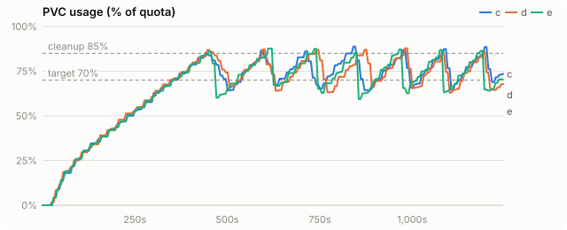
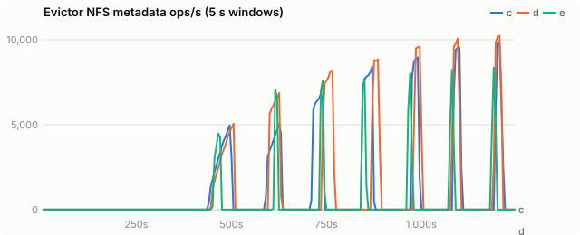
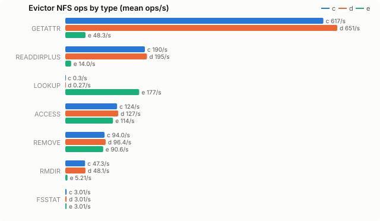
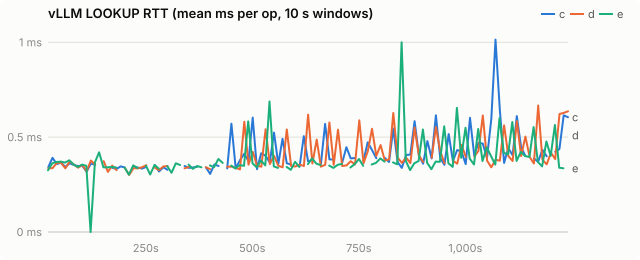
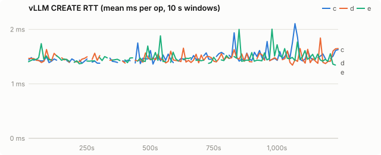
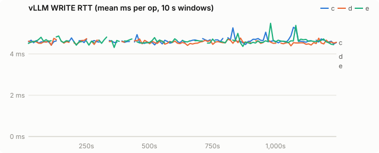
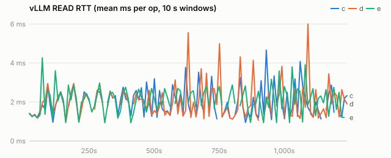
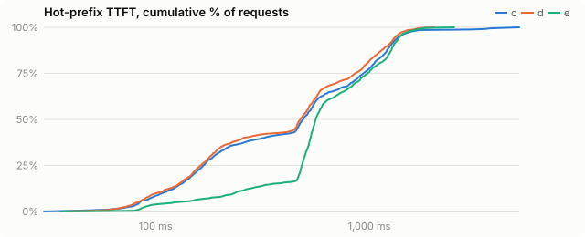

# Chain-aware eviction spike: vLLM 0.31 on VAST

| run | evictor image |
|---|---|
| c | `quay.io/wseaton/kvreap:e-3d5cd6d` |
| d | `quay.io/wseaton/kvreap:d-a2a0bbe` |
| e | `quay.io/wseaton/kvreap:e-3d5cd6d` |

One 20-minute run per variant on coreweave-waldorf (1× H200, VAST), Qwen/Qwen3-0.6B, same settings as `benchmarks/README.md`, run back to back on 2026-10-09. All three run vLLM with `--kv-events` (vLLM publishes KV events over ZMQ and the fs tier publishes `STORAGE` stores). c and e use the same image and vLLM config, with block hashes sent as bytes; only `CHAIN_EVICTION` differs. d ran earlier on an image with the same tail-first code and vLLM's default int hashes, which tail-first does not need.

- **c**: `observe`. Plain sampled LRU (oldest-written first); the chain index only classifies deletions.
- **d**: `tail-first`. Among the oldest candidates, delete dead blocks, then childless ones, deferring chain interiors up to 8 rounds.
- **e**: `subtree`. Among the oldest candidates, pick dead blocks first, then the block whose on-disk subtree frees the most blocks per leaf (continuation) lost; delete it and every on-disk block below it.

## Findings

Subtree eviction helps a lot. Tail-first does not.

| | c (plain) | d (tail-first) | e (subtree) | e vs c |
|---|---|---|---|---|
| FS-tier chunk hits | 76,986 | 79,897 | **138,019** | +79% |
| external prefix-cache hits | 1.09M | 1.13M | **2.02M** | +86% |
| vLLM promotion (load) failures | 158 | 186 | **14** | −91% |
| hot-prefix TTFT p50 / p90 / p99 ms | 492 / 1,252 / 3,378 | 476 / 1,220 / 1,638 | 562 / 1,297 / **1,687** | +14% / +4% / −50% |
| evictor metadata ops/s (mean) | 1,076 | 1,120 | **452** | −58% |
| median prune (85% → 70%) | 30 s | 20.5 s | **10 s** | 3× faster |
| fs-tier bytes written by vLLM | 445 GB | 446 GB | **315 GB** | −29% |
| churn throughput (input tok/s) | 33.2k | 34.5k | 34.8k | +5% |

Deletions by chain position (from the evictor's `chains` counters):

| | c | d | e |
|---|---|---|---|
| root (first block of a prompt) | 529 | 549 | 18 |
| orphan (parent already gone: a dead tail) | 47,330 | 49,241 | 112,180 |
| internal (parent and a child still on disk) | 50,186 | 49,349 | 795 |
| leaf | 19,240 | 21,165 | 2 |
| cascaded below a deleted subtree root | 0 | 0 | 112,260 |

- **The starting hypothesis was wrong.** Oldest-first eviction does not delete chain heads first: 43% of plain kvreap's deletions are mid-chain cuts and 40% are dead tails left by earlier cuts. Sampling random buckets puts a chain's blocks into the pool at random times, so chains get cut in the middle regardless of order. Reordering the pool (tail-first) cannot fix that: a 256-block churn chain has one leaf, so a window of oldest candidates almost never holds it, and interiors run out of deferrals.
- **Subtree eviction cuts each chain once and deletes everything that cut made useless.** 99% of its deletions are dead blocks found through the index and unlinked by path, with no sampling or stat. Surviving chains stay whole, so 79% more prefix blocks are served from the fs tier, vLLM recomputes and rewrites 29% fewer bytes, and almost no promotion races a deletion.
- **TTFT.** p99 halves. p50 is 14% worse: E reads 87% more KV from VAST, and for a 0.6B model reading a 2,048-token prefix back costs about the same as recomputing it on an H200. The extra hits pay off when prefill is expensive; a Qwen3-32B TP=2 pair is the follow-up measurement.

## Follow-up: agentic workload

Subtree eviction deletes every block below the one it picks, so a shared system prompt (written once, the oldest block on disk) would take every session that extends it. Radix eviction (`CHAIN_EVICTION=radix`) only deletes radix-tree leaf edges, the unshared tail of one cached prefix, aged by the session's last write. On a long-session agentic workload with a shared preamble (Qwen3-32B, after fixing vLLM's fs-tier read path), radix eviction completes 23% more requests and cuts returning-turn TTFT p90 from 6.6 s to 1.8 s against plain sampled LRU. See [chain-spike-agent.md](chain-spike-agent.md).

## Caveats

- n = 1 per variant. E's hot generator completed 24 of 25 iterations (1,536 of 1,600 requests) in the window.
- vLLM 0.31 sends block hashes as 64-bit ints by default (`VLLM_KV_EVENTS_USE_INT_BLOCK_HASHES=1`). Subtree eviction needs the full hash to name descendant files, so kvbench sets it to 0 with `--kv-events`; with ints kvreap logs `undigested` and cannot cascade.
- The `STORAGE` events come from the fs tier's `enable_kv_events: true`; without them (`KV_EVENTS_DISK_MEDIUM` unset) every GPU-cached block counts as on disk and the index overcounts children by ~6×.
- E overshoots the 70% target on some prunes (60.1% and 59.5% once each): a subtree is deleted whole and usage is polled every 0.5 s. Stopping a cascade when the freed bytes reach the target is a follow-up.
- The chain index costs memory: about 750k blocks (with parent links, child lists and 32-byte digests) after 20 minutes, capped at 4M.
- With tensor parallelism each block has one file per rank; subtree eviction deletes all ranks of a block together. That path has a unit test but no benchmark here.
- Everything chain-related is behind the off-by-default `events` feature (libzmq links SHA-1); the default build is unchanged.

## Setup

| setting | value |
|---|---|
| model | Qwen/Qwen3-0.6B |
| vLLM image | docker.io/vllm/vllm-openai:v0.31.0 |
| PVC size | 100Gi |
| storage class | kvreap-bench-vast |
| load duration (s) | 1200 |
| offload block (tokens) | 16 |
| CPU tier (bytes) | 2147483648 |
| GPU KV blocks | 4096 |
| churn prompt length | 4096 |
| churn concurrency | 8 |
| hot prefixes | 64 |
| hot prefix length | 2048 |
| hot request rate (req/s) | 2.0 |

Time axes are seconds since the load generator started.

## PVC usage

<picture><source media="(prefers-color-scheme: dark)" srcset="chain-spike/charts/usage-dark.svg"></picture>

## Evictor metadata load

<picture><source media="(prefers-color-scheme: dark)" srcset="chain-spike/charts/evictor-ops-dark.svg"></picture>

## Evictor ops by type

<picture><source media="(prefers-color-scheme: dark)" srcset="chain-spike/charts/evictor-op-types-dark.svg"></picture>

## vLLM LOOKUP latency

<picture><source media="(prefers-color-scheme: dark)" srcset="chain-spike/charts/rtt-lookup-dark.svg"></picture>

## vLLM CREATE latency

<picture><source media="(prefers-color-scheme: dark)" srcset="chain-spike/charts/rtt-create-dark.svg"></picture>

## vLLM WRITE latency

<picture><source media="(prefers-color-scheme: dark)" srcset="chain-spike/charts/rtt-write-dark.svg"></picture>

## vLLM READ latency

<picture><source media="(prefers-color-scheme: dark)" srcset="chain-spike/charts/rtt-read-dark.svg"></picture>

## Hot-prefix TTFT

<picture><source media="(prefers-color-scheme: dark)" srcset="chain-spike/charts/ttft-dark.svg"></picture>

## All metrics

| metric | c | d | e |
|---|---|---|---|
| load duration (s) | 1,249 | 1,250 | 1,248 |
| **evictor metadata ops/s (mean)** | 1,076.2 | 1,120.4 | 451.9 |
| evictor metadata ops (total) | 1,343,114 | 1,398,202 | 563,489 |
| evictor ACCESS/s (mean / p95 10s) | 123.9 / 761.8 | 126.6 / 803.6 | 114.0 / 1,112.5 |
| evictor CREATE/s (mean / p95 10s) | 0.0 / 0.0 | 0.0 / 0.0 | 0.0 / 0.0 |
| evictor FSINFO/s (mean / p95 10s) | 0.0 / 0.0 | 0.0 / 0.0 | 0.0 / 0.0 |
| evictor FSSTAT/s (mean / p95 10s) | 3.0 / 3.1 | 3.0 / 3.1 | 3.0 / 3.1 |
| evictor GETATTR/s (mean / p95 10s) | 617.4 / 4,545.1 | 650.7 / 4,324.2 | 48.3 / 259.6 |
| evictor LOOKUP/s (mean / p95 10s) | 0.3 / 1.3 | 0.3 / 0.4 | 176.8 / 1,437.8 |
| evictor NULL/s (mean / p95 10s) | 0.0 / 0.0 | 0.0 / 0.0 | 0.0 / 0.0 |
| evictor PATHCONF/s (mean / p95 10s) | 0.0 / 0.0 | 0.0 / 0.0 | 0.0 / 0.0 |
| evictor READ/s (mean / p95 10s) | 0.0 / 0.0 | 0.0 / 0.0 | 0.0 / 0.0 |
| evictor READDIRPLUS/s (mean / p95 10s) | 190.3 / 1,320.3 | 195.3 / 1,278.2 | 14.0 / 118.1 |
| evictor REMOVE/s (mean / p95 10s) | 94.0 / 655.0 | 96.4 / 642.5 | 90.6 / 726.9 |
| evictor RMDIR/s (mean / p95 10s) | 47.3 / 423.8 | 48.1 / 368.0 | 5.2 / 38.1 |
| evictor SETATTR/s (mean / p95 10s) | 0.0 / 0.0 | 0.0 / 0.0 | 0.0 / 0.0 |
| evictor WRITE/s (mean / p95 10s) | 0.0 / 0.0 | 0.0 / 0.0 | 0.0 / 0.0 |
| vLLM LOOKUP RTT ms (all) | 0.38 | 0.37 | 0.36 |
| vLLM LOOKUP RTT ms (deleting / idle) | 0.39 / 0.38 | 0.38 / 0.37 | 0.40 / 0.36 |
| vLLM GETATTR RTT ms (all) | 0.39 | 0.38 | 0.38 |
| vLLM GETATTR RTT ms (deleting / idle) | 0.37 / 0.39 | 0.37 / 0.38 | 0.38 / 0.38 |
| vLLM CREATE RTT ms (all) | 1.47 | 1.44 | 1.45 |
| vLLM CREATE RTT ms (deleting / idle) | 1.45 / 1.47 | 1.44 / 1.45 | 1.44 / 1.45 |
| vLLM RENAME RTT ms (all) | 2.28 | 2.26 | 2.27 |
| vLLM RENAME RTT ms (deleting / idle) | 2.27 / 2.29 | 2.25 / 2.26 | 2.27 / 2.27 |
| vLLM WRITE RTT ms (all) | 4.63 | 4.57 | 4.62 |
| vLLM WRITE RTT ms (deleting / idle) | 4.60 / 4.64 | 4.55 / 4.57 | 4.60 / 4.62 |
| vLLM READ RTT ms (all) | 2.02 | 2.02 | 2.19 |
| vLLM READ RTT ms (deleting / idle) | 1.85 / 2.03 | 1.89 / 2.04 | 2.43 / 2.18 |
| vLLM LOOKUP client queue ms | 0.003 | 0.002 | 0.002 |
| vLLM GETATTR client queue ms | 0.004 | 0.003 | 0.003 |
| vLLM CREATE client queue ms | 0.002 | 0.001 | 0.001 |
| vLLM RENAME client queue ms | 0.010 | 0.009 | 0.009 |
| vLLM WRITE client queue ms | 0.092 | 0.086 | 0.088 |
| vLLM READ client queue ms | 0.009 | 0.009 | 0.009 |
| vLLM FS read s/GiB | 2.27 | 2.23 | 2.16 |
| vLLM FS write s/GiB | 4.89 | 4.77 | 6.61 |
| vLLM metadata ops/s | 2,252.9 | 2,250.7 | 2,233.1 |
| prune cycles | 7 | 7 | 7 |
| prune seconds (median) | 30.0 | 20.5 | 10.0 |
| max usage % | 88.7 | 87.9 | 87.7 |
| % time >= cleanup threshold | 5.6 | 6.4 | 5.7 |
| hot ttft p50 ms | 491.7 | 476.2 | 562.0 |
| hot ttft p90 ms | 1,252.1 | 1,219.8 | 1,297.2 |
| hot ttft p99 ms | 3,377.6 | 1,637.8 | 1,687.1 |
| hot requests (failed) | 1,600 (0) | 1,600 (0) | 1,536 (0) |
| churn input tok/s | 33,162 | 34,513 | 34,811 |
| vLLM log: quota_exceeded | 0 | 0 | 0 |
| vLLM log: store_failed | 0 | 0 | 0 |
| vLLM log: load_failed | 158 | 186 | 14 |
| chain deletions: heads (root + orphan) | 47,859 | 49,790 | 112,198 |
| chain deletions: root | 529 | 549 | 18 |
| chain deletions: orphan (parent gone) | 47,330 | 49,241 | 112,180 |
| chain deletions: internal | 50,186 | 49,349 | 795 |
| chain deletions: leaf | 19,240 | 21,165 | 2 |
| chain deletions: untracked | 0 | 0 | 0 |
| chain deferrals | 0 | 456,841 | 0 |
| chain deletions: cascaded below a deleted root | 0 | - | 112,260 |
| blocks announced without a digest | 0 | - | 0 |
| KV event batches received | 14,663 | 14,734 | 13,507 |
| KV event decode errors | 0 | 0 | 0 |
| `vllm:external_prefix_cache_hits_total{engine="0",model_name="Qwen/Qwen3-0.6B"}` Δ | 1,087,120 | 1,127,824 | 2,019,664 |
| `vllm:external_prefix_cache_queries_total{engine="0",model_name="Qwen/Qwen3-0.6B"}` Δ | 15,906,857 | 15,910,937 | 15,773,736 |
| `vllm:kv_offload_allocation_failure_total{engine="0",model_name="Qwen/Qwen3-0.6B"}` Δ | 25,685 | 25,368 | 25,955 |
| `vllm:kv_offload_load_bytes_total{engine="0",model_name="Qwen/Qwen3-0.6B"}` Δ | 124,679,618,560 | 129,347,878,912 | 231,631,224,832 |
| `vllm:kv_offload_load_time_total{engine="0",model_name="Qwen/Qwen3-0.6B"}` Δ | 3 | 4 | 6 |
| `vllm:kv_offload_store_bytes_total{engine="0",model_name="Qwen/Qwen3-0.6B"}` Δ | 444,664,643,584 | 446,444,601,344 | 314,676,346,880 |
| `vllm:kv_offload_store_time_total{engine="0",model_name="Qwen/Qwen3-0.6B"}` Δ | 13 | 12 | 9 |
| `vllm:kv_offload_tiering_chunk_hits_total{engine="0",model_name="Qwen/Qwen3-0.6B",tier="1:fs"}` Δ | 76,986 | 79,897 | 138,019 |
| `vllm:kv_offload_tiering_chunk_queries_total{engine="0",model_name="Qwen/Qwen3-0.6B",tier="0:primary"}` Δ | 994,177 | 994,432 | 985,857 |
| `vllm:kv_offload_tiering_chunk_queries_total{engine="0",model_name="Qwen/Qwen3-0.6B",tier="1:fs"}` Δ | 81,110 | 84,001 | 141,460 |
| `vllm:kv_offload_tiering_promotion_allocation_failures_total{engine="0",model_name="Qwen/Qwen3-0.6B"}` Δ | 2,905 | 2,451 | 4,720 |
| `vllm:kv_offload_tiering_promotion_job_failures_total{engine="0",model_name="Qwen/Qwen3-0.6B",tier="1:fs"}` Δ | 158 | 186 | 14 |
| `vllm:kv_offload_tiering_read_bytes_total{engine="0",model_name="Qwen/Qwen3-0.6B",tier="1:fs"}` Δ | 137,954,066,432 | 142,967,308,288 | 257,730,543,616 |
| `vllm:kv_offload_tiering_read_time_total{engine="0",model_name="Qwen/Qwen3-0.6B",tier="1:fs"}` Δ | 292 | 298 | 518 |
| `vllm:kv_offload_tiering_write_bytes_total{engine="0",model_name="Qwen/Qwen3-0.6B",tier="1:fs"}` Δ | 444,664,643,584 | 446,444,601,344 | 314,676,346,880 |
| `vllm:kv_offload_tiering_write_time_total{engine="0",model_name="Qwen/Qwen3-0.6B",tier="1:fs"}` Δ | 2,023 | 1,983 | 1,936 |
| `vllm:kv_offload_total_bytes_total{engine="0",model_name="Qwen/Qwen3-0.6B",transfer_type="CPU_to_GPU"}` Δ | 124,679,618,560 | 129,347,878,912 | 231,631,224,832 |
| `vllm:kv_offload_total_bytes_total{engine="0",model_name="Qwen/Qwen3-0.6B",transfer_type="GPU_to_CPU"}` Δ | 444,664,643,584 | 446,444,601,344 | 314,676,346,880 |
| `vllm:kv_offload_total_time_total{engine="0",model_name="Qwen/Qwen3-0.6B",transfer_type="CPU_to_GPU"}` Δ | 3 | 4 | 6 |
| `vllm:kv_offload_total_time_total{engine="0",model_name="Qwen/Qwen3-0.6B",transfer_type="GPU_to_CPU"}` Δ | 13 | 12 | 9 |
| `vllm:prefix_cache_hits_total{engine="0",model_name="Qwen/Qwen3-0.6B"}` Δ | 4,080 | - | 4,080 |
| `vllm:prefix_cache_queries_total{engine="0",model_name="Qwen/Qwen3-0.6B"}` Δ | 15,910,937 | 15,910,937 | 15,777,816 |
