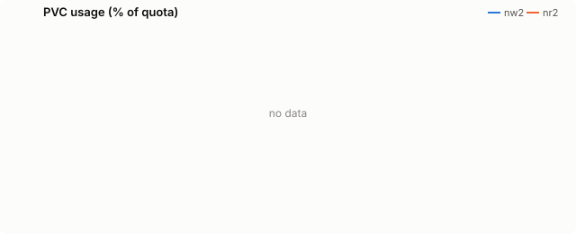
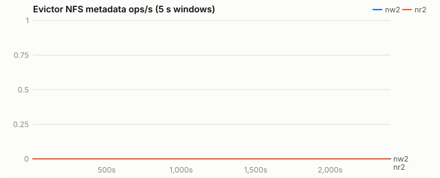
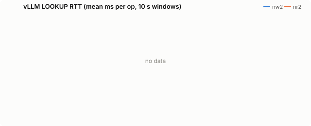
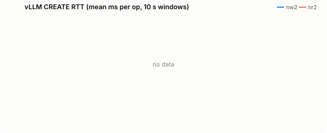
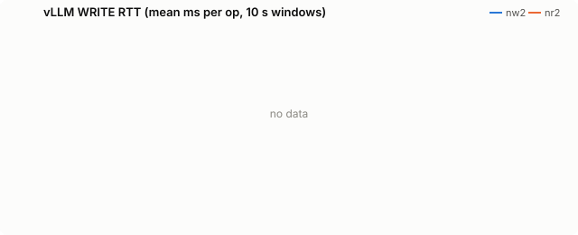
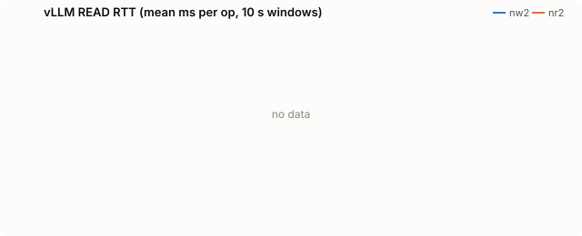
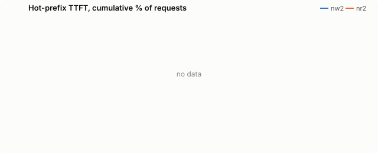

# Final: kvreap on node-local NVMe, Qwen2.5-72B TP=4

| run | evictor image |
|---|---|
| nw2 | `quay.io/wseaton/kvreap:r-0668381` |
| nr2 | `quay.io/wseaton/kvreap:r-0668381` |

The same 72B agentic load with the fs tier on the node's own NVMe (CoreWeave `/mnt/local`, an encrypted 8-drive RAID10, 27.9 TiB per H200 node) through a hostPath, for single-node deployments. kvreap runs on vLLM's node with `CAPACITY_BYTES` set to the 160 GiB budget, because statvfs on `/mnt/local` reports the whole node disk. **nw2** (kvreap plain LRU) and **nr2** (kvreap radix) ran at the same time, both on `r-0668381`.

The Python `pvc_evictor` cannot run here. It sizes the disk only through statvfs, so on this hostPath it reads the node's 27.9 TiB and never reaches its cleanup threshold; `benchmarks/hostpath-proof/` runs its own usage function after overfilling a 16 GiB budget by 25%.

## Findings

| | nw2: kvreap plain LRU | nr2: kvreap radix | nr2 vs nw2 |
|---|---|---|---|
| requests completed in 40 min | 2,656 | **3,380** | +27% |
| prefix tokens served from offload tiers | 35.6M of 46.4M | **55.0M of 58.8M** | +55% |
| returning-turn TTFT p90 | 2,390 ms | **1,859 ms** | −22% |
| returning-turn TTFT p99 | 5,966 ms | **2,721 ms** | 2.2× lower |
| first-turn TTFT p90 | 3,395 ms | **2,719 ms** | −20% |
| KV rewritten to NVMe | 1.79 TB | **0.63 TB** | −65% |
| deletions that cut a live chain (internal) | 82,501 | **24** | |

- **NVMe cuts tail latency for both policies** compared with VAST (plain LRU p99 6.0 s here vs 11.0 s on VAST), and radix keeps its lead.
- **Usage overshoot.** The sampled `CAPACITY_BYTES` estimate reads low: the sampler's byte count peaked at 110.9% of budget for radix and 102.1% for plain while kvreap's estimate stayed below the emergency band most of the run. Counting bytes from the chain index instead of sampling is the fix.

## Setup

| setting | value |
|---|---|
| model | Qwen/Qwen2.5-72B-Instruct |
| vLLM image | docker.io/vllm/vllm-openai:v0.31.0 |
| PVC size | 160Gi |
| storage class | kvreap-bench-vast |
| load duration (s) | 2400 |
| offload block (tokens) | 16 |
| CPU tier (bytes) | 34359738368 |
| GPU KV blocks | 16384 |
| churn prompt length | 4096 |
| churn concurrency | 8 |
| hot prefixes | 64 |
| hot prefix length | 2048 |
| hot request rate (req/s) | 2.0 |

Time axes are seconds since the load generator started.

## PVC usage

<picture><source media="(prefers-color-scheme: dark)" srcset="final-nvme/charts/usage-dark.svg"></picture>

## Evictor metadata load

<picture><source media="(prefers-color-scheme: dark)" srcset="final-nvme/charts/evictor-ops-dark.svg"></picture>

## Evictor ops by type

<picture><source media="(prefers-color-scheme: dark)" srcset="final-nvme/charts/evictor-op-types-dark.svg"></picture>

## vLLM LOOKUP latency

<picture><source media="(prefers-color-scheme: dark)" srcset="final-nvme/charts/rtt-lookup-dark.svg"></picture>

## vLLM CREATE latency

<picture><source media="(prefers-color-scheme: dark)" srcset="final-nvme/charts/rtt-create-dark.svg"></picture>

## vLLM WRITE latency

<picture><source media="(prefers-color-scheme: dark)" srcset="final-nvme/charts/rtt-write-dark.svg"></picture>

## vLLM READ latency

<picture><source media="(prefers-color-scheme: dark)" srcset="final-nvme/charts/rtt-read-dark.svg"></picture>

## Hot-prefix TTFT

<picture><source media="(prefers-color-scheme: dark)" srcset="final-nvme/charts/ttft-dark.svg"></picture>

## All metrics

| metric | nw2 | nr2 |
|---|---|---|
| load duration (s) | 2,405 | 2,404 |
| **evictor metadata ops/s (mean)** | 0.0 | 0.0 |
| evictor metadata ops (total) | 0 | 0 |
| vLLM LOOKUP RTT ms (all) | - | - |
| vLLM LOOKUP RTT ms (deleting / idle) | - / - | - / - |
| vLLM GETATTR RTT ms (all) | - | - |
| vLLM GETATTR RTT ms (deleting / idle) | - / - | - / - |
| vLLM CREATE RTT ms (all) | - | - |
| vLLM CREATE RTT ms (deleting / idle) | - / - | - / - |
| vLLM RENAME RTT ms (all) | - | - |
| vLLM RENAME RTT ms (deleting / idle) | - / - | - / - |
| vLLM WRITE RTT ms (all) | - | - |
| vLLM WRITE RTT ms (deleting / idle) | - / - | - / - |
| vLLM READ RTT ms (all) | - | - |
| vLLM READ RTT ms (deleting / idle) | - / - | - / - |
| vLLM LOOKUP client queue ms | - | - |
| vLLM GETATTR client queue ms | - | - |
| vLLM CREATE client queue ms | - | - |
| vLLM RENAME client queue ms | - | - |
| vLLM WRITE client queue ms | - | - |
| vLLM READ client queue ms | - | - |
| vLLM FS read s/GiB | 9.39 | 9.23 |
| vLLM FS write s/GiB | 2.10 | 6.89 |
| vLLM metadata ops/s | 0 | 0 |
| prune cycles | 16 | 7 |
| prune seconds (median) | 10.3 | 33.0 |
| max usage % | 102.1 | 110.9 |
| % time >= cleanup threshold | 14.6 | 12.1 |
| hot ttft p50 ms | - | - |
| hot ttft p90 ms | - | - |
| hot ttft p99 ms | - | - |
| agent requests | 2,656 | 3,380 |
| agent failed | 0 | 0 |
| agent first ttft p50 ms | 1,092.2 | 1,097.7 |
| agent first ttft p90 ms | 3,395.4 | 2,719.3 |
| agent later ttft p50 ms | 1,072.2 | 1,087.1 |
| agent later ttft p90 ms | 2,389.8 | 1,859.1 |
| agent later ttft p99 ms | 5,965.5 | 2,720.5 |
| agent prompt tok per s | - | - |
| hot requests (failed) | - (-) | - (-) |
| churn input tok/s | - | - |
| vLLM log: quota_exceeded | 0 | 0 |
| vLLM log: store_failed | 0 | 0 |
| vLLM log: load_failed | 29 | 56 |
| chain deletions: heads (root + orphan) | 56,487 | 110 |
| chain deletions: root | 147 | 1 |
| chain deletions: orphan (parent gone) | 56,340 | 109 |
| chain deletions: internal | 82,501 | 24 |
| chain deletions: leaf | 23,467 | 181,952 |
| chain deletions: untracked | 0 | 11,108 |
| chain deferrals | 0 | 0 |
| chain deletions: cascaded below a deleted root | 0 | 193,042 |
| blocks announced without a digest | 0 | 0 |
| leaf edges skipped as too young | 0 | 2,906 |
| young leaf edges deleted under pressure | 0 | 150 |
| KV event batches received | 35,319 | 44,132 |
| KV event decode errors | 0 | 0 |
| `vllm:external_prefix_cache_hits_total{engine="0",model_name="Qwen/Qwen2.5-72B-Instruct"}` Δ | 35,596,608 | 55,023,824 |
| `vllm:external_prefix_cache_queries_total{engine="0",model_name="Qwen/Qwen2.5-72B-Instruct"}` Δ | 46,391,015 | 58,770,343 |
| `vllm:kv_offload_load_bytes_total{engine="0",model_name="Qwen/Qwen2.5-72B-Instruct"}` Δ | 5,832,148,254,720 | 9,015,103,324,160 |
| `vllm:kv_offload_load_time_total{engine="0",model_name="Qwen/Qwen2.5-72B-Instruct"}` Δ | 194 | 377 |
| `vllm:kv_offload_store_bytes_total{engine="0",model_name="Qwen/Qwen2.5-72B-Instruct"}` Δ | 1,790,868,193,280 | 628,815,298,560 |
| `vllm:kv_offload_store_time_total{engine="0",model_name="Qwen/Qwen2.5-72B-Instruct"}` Δ | 74 | 42 |
| `vllm:kv_offload_tiering_chunk_hits_total{engine="0",model_name="Qwen/Qwen2.5-72B-Instruct",tier="1:StripedFileSystemTierManager"}` Δ | 2,232,150 | 3,442,387 |
| `vllm:kv_offload_tiering_chunk_queries_total{engine="0",model_name="Qwen/Qwen2.5-72B-Instruct",tier="0:primary"}` Δ | 2,898,165 | 3,673,884 |
| `vllm:kv_offload_tiering_chunk_queries_total{engine="0",model_name="Qwen/Qwen2.5-72B-Instruct",tier="1:StripedFileSystemTierManager"}` Δ | 2,234,812 | 3,445,774 |
| `vllm:kv_offload_tiering_promotion_job_failures_total{engine="0",model_name="Qwen/Qwen2.5-72B-Instruct",tier="1:StripedFileSystemTierManager"}` Δ | 16 | 7 |
| `vllm:kv_offload_tiering_read_bytes_total{engine="0",model_name="Qwen/Qwen2.5-72B-Instruct",tier="1:StripedFileSystemTierManager"}` Δ | 5,832,148,254,720 | 9,021,056,614,400 |
| `vllm:kv_offload_tiering_read_time_total{engine="0",model_name="Qwen/Qwen2.5-72B-Instruct",tier="1:StripedFileSystemTierManager"}` Δ | 50,998 | 77,505 |
| `vllm:kv_offload_tiering_write_bytes_total{engine="0",model_name="Qwen/Qwen2.5-72B-Instruct",tier="1:StripedFileSystemTierManager"}` Δ | 1,790,868,193,280 | 628,815,298,560 |
| `vllm:kv_offload_tiering_write_time_total{engine="0",model_name="Qwen/Qwen2.5-72B-Instruct",tier="1:StripedFileSystemTierManager"}` Δ | 3,501 | 4,034 |
| `vllm:kv_offload_total_bytes_total{engine="0",model_name="Qwen/Qwen2.5-72B-Instruct",transfer_type="CPU_to_GPU"}` Δ | 5,832,148,254,720 | 9,015,103,324,160 |
| `vllm:kv_offload_total_bytes_total{engine="0",model_name="Qwen/Qwen2.5-72B-Instruct",transfer_type="GPU_to_CPU"}` Δ | 1,790,868,193,280 | 628,815,298,560 |
| `vllm:kv_offload_total_time_total{engine="0",model_name="Qwen/Qwen2.5-72B-Instruct",transfer_type="CPU_to_GPU"}` Δ | 194 | 377 |
| `vllm:kv_offload_total_time_total{engine="0",model_name="Qwen/Qwen2.5-72B-Instruct",transfer_type="GPU_to_CPU"}` Δ | 74 | 42 |
| `vllm:prefix_cache_hits_total{engine="0",model_name="Qwen/Qwen2.5-72B-Instruct"}` Δ | 4,316,352 | 5,441,344 |
| `vllm:prefix_cache_queries_total{engine="0",model_name="Qwen/Qwen2.5-72B-Instruct"}` Δ | 50,707,367 | 64,211,687 |
