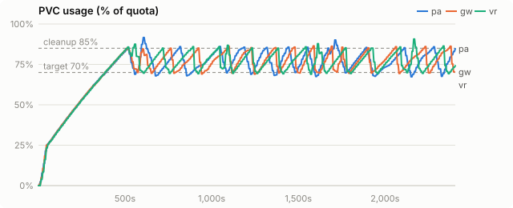
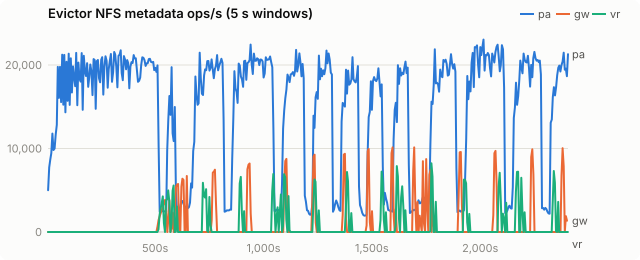
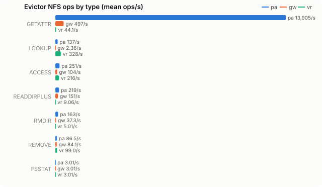
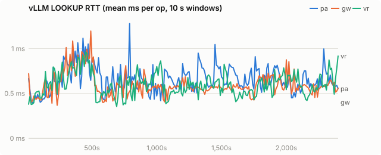
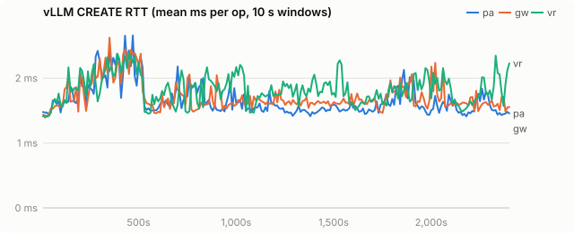
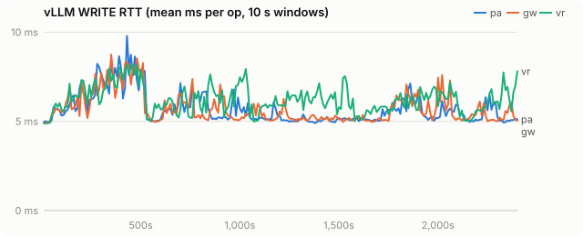
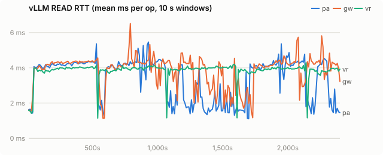
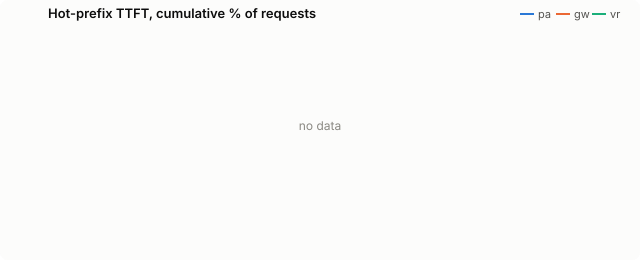

# Final: Python pvc_evictor vs kvreap on VAST, Qwen2.5-72B TP=4

| run | evictor image |
|---|---|
| pa | `quay.io/wseaton/pvc-evictor:a-f62b9a7` |
| gw | `quay.io/wseaton/kvreap:r-962281f` |
| vr | `quay.io/wseaton/kvreap:r-0668381` |

Final comparison on a shared VAST PVC: the llm-d Python `pvc_evictor` (upstream main, `quay.io/wseaton/pvc-evictor:a-f62b9a7`), kvreap's plain sampled LRU (`observe`), and kvreap's radix eviction. Qwen/Qwen2.5-72B-Instruct, TP=4, `--kv-cache-dtype fp8`, 4× H200 per run, fs tier on VAST through the striped tier plugin. nyann-bench `conversation_pool`: 32 sessions in rotation, 8 in flight, 2,048-token shared preamble, 8,000-token first turn, up to 30 turns of 500 tokens with 200-token replies. 40 minutes per run, 160Gi PVC, CPU tier 32 GiB, cleanup 85%, target 70%.

**pa** (Python) and **vr** (kvreap radix, `r-0668381`) ran at the same time. **gw** (kvreap plain LRU, `r-962281f`) ran earlier the same day with identical settings; the limiter and missing-file fixes in `r-0668381` only change radix behavior.

## Findings

| | pa: Python pvc_evictor | gw: kvreap plain LRU | vr: kvreap radix | vr vs pa |
|---|---|---|---|---|
| requests completed in 40 min | 2,748 | 2,734 | **4,345** | +58% |
| prefix tokens served from offload tiers | 35.5M of 48.8M | 34.4M of 48.3M | **70.8M of 76.2M** | 2.0× |
| returning-turn TTFT p50 | 645 ms | 643 ms | **593 ms** | −8% |
| returning-turn TTFT p90 | 6,295 ms | 4,408 ms | **940 ms** | 6.7× lower |
| returning-turn TTFT p99 | 18,104 ms | 11,032 ms | **3,176 ms** | 5.7× lower |
| first-turn TTFT p90 | 6,102 ms | 3,810 ms | **2,961 ms** | 2.1× lower |
| KV rewritten to VAST | 2.19 TB | 2.29 TB | **0.90 TB** | −59% |
| evictor NFS metadata ops/s (mean) | 14,765 | 879 | **704** | 21× fewer |
| deletions that cut a live chain (internal) | not tracked | 110,889 | **33** | |
| vLLM promotion (load) failures | 68 | 126 | **50** | |

- **Eviction choice is the difference.** The Python evictor deletes whatever its crawl reaches first, and kvreap's plain LRU deletes oldest-written first. Both cut live sessions at their oldest blocks, so every later turn of a cut session recomputes from the cut and writes the result again. They end up at the same throughput. Radix deletes whole unshared session tails by last write and never a prefix two sessions share. It serves twice the prefix tokens from disk and completes 58% more requests.
- **Metadata cost.** The Python evictor's crawlers stat every file continuously: 14,765 NFS metadata ops/s averaged over the run, 21× kvreap radix.
- **Usage stayed in band for all three** (max 91.6% / 86.5% / 90.7%). The Python evictor works on VAST; it chooses badly and costs more to run. On node-local NVMe it does not work at all: see `benchmarks/hostpath-proof/`.

## Setup

| setting | value |
|---|---|
| model | Qwen/Qwen2.5-72B-Instruct |
| vLLM image | docker.io/vllm/vllm-openai:v0.31.0 |
| PVC size | 160Gi |
| storage class | kvreap-bench-vast |
| load duration (s) | 2400 |
| offload block (tokens) | 16 |
| CPU tier (bytes) | 34359738368 |
| GPU KV blocks | 16384 |
| churn prompt length | 4096 |
| churn concurrency | 8 |
| hot prefixes | 64 |
| hot prefix length | 2048 |
| hot request rate (req/s) | 2.0 |

Time axes are seconds since the load generator started.

## PVC usage

<picture><source media="(prefers-color-scheme: dark)" srcset="final-vast/charts/usage-dark.svg"></picture>

## Evictor metadata load

<picture><source media="(prefers-color-scheme: dark)" srcset="final-vast/charts/evictor-ops-dark.svg"></picture>

## Evictor ops by type

<picture><source media="(prefers-color-scheme: dark)" srcset="final-vast/charts/evictor-op-types-dark.svg"></picture>

## vLLM LOOKUP latency

<picture><source media="(prefers-color-scheme: dark)" srcset="final-vast/charts/rtt-lookup-dark.svg"></picture>

## vLLM CREATE latency

<picture><source media="(prefers-color-scheme: dark)" srcset="final-vast/charts/rtt-create-dark.svg"></picture>

## vLLM WRITE latency

<picture><source media="(prefers-color-scheme: dark)" srcset="final-vast/charts/rtt-write-dark.svg"></picture>

## vLLM READ latency

<picture><source media="(prefers-color-scheme: dark)" srcset="final-vast/charts/rtt-read-dark.svg"></picture>

## Hot-prefix TTFT

<picture><source media="(prefers-color-scheme: dark)" srcset="final-vast/charts/ttft-dark.svg"></picture>

## All metrics

| metric | pa | gw | vr |
|---|---|---|---|
| load duration (s) | 2,407 | 2,405 | 2,406 |
| **evictor metadata ops/s (mean)** | 14,765.3 | 878.7 | 704.3 |
| evictor metadata ops (total) | 35,525,343 | 2,112,321 | 1,694,598 |
| evictor ACCESS/s (mean / p95 10s) | 251.3 / 669.3 | 103.7 / 704.9 | 215.8 / 1,394.9 |
| evictor CREATE/s (mean / p95 10s) | - | 0.0 / 0.0 | 0.0 / 0.0 |
| evictor FSINFO/s (mean / p95 10s) | 0.0 / 0.0 | 0.0 / 0.0 | 0.0 / 0.0 |
| evictor FSSTAT/s (mean / p95 10s) | 3.0 / 3.1 | 3.0 / 3.1 | 3.0 / 3.1 |
| evictor GETATTR/s (mean / p95 10s) | 13,905.5 / 20,643.8 | 496.8 / 3,247.9 | 44.1 / 291.9 |
| evictor LOOKUP/s (mean / p95 10s) | 136.6 / 744.9 | 2.4 / 1.5 | 328.3 / 2,164.3 |
| evictor NULL/s (mean / p95 10s) | 0.0 / 0.0 | 0.0 / 0.0 | 0.0 / 0.0 |
| evictor PATHCONF/s (mean / p95 10s) | 0.0 / 0.0 | 0.0 / 0.0 | 0.0 / 0.0 |
| evictor READ/s (mean / p95 10s) | - | 0.0 / 0.0 | 0.0 / 0.0 |
| evictor READDIRPLUS/s (mean / p95 10s) | 218.9 / 785.4 | 151.4 / 987.5 | 9.1 / 48.6 |
| evictor REMOVE/s (mean / p95 10s) | 86.5 / 370.6 | 84.1 / 583.1 | 99.0 / 681.5 |
| evictor RMDIR/s (mean / p95 10s) | 163.4 / 438.9 | 37.3 / 263.7 | 5.0 / 31.0 |
| evictor SETATTR/s (mean / p95 10s) | - | 0.0 / 0.0 | 0.0 / 0.0 |
| evictor WRITE/s (mean / p95 10s) | - | 0.0 / 0.0 | 0.0 / 0.0 |
| vLLM LOOKUP RTT ms (all) | 0.67 | 0.57 | 0.55 |
| vLLM LOOKUP RTT ms (deleting / idle) | 0.73 / 0.63 | 0.49 / 0.59 | 0.49 / 0.58 |
| vLLM GETATTR RTT ms (all) | 1.40 | 1.31 | 1.33 |
| vLLM GETATTR RTT ms (deleting / idle) | 1.12 / 1.45 | 0.91 / 1.35 | 1.27 / 1.35 |
| vLLM CREATE RTT ms (all) | 1.62 | 1.67 | 1.74 |
| vLLM CREATE RTT ms (deleting / idle) | 1.57 / 1.64 | 1.55 / 1.72 | 1.63 / 1.79 |
| vLLM RENAME RTT ms (all) | 2.57 | 2.62 | 2.71 |
| vLLM RENAME RTT ms (deleting / idle) | 2.52 / 2.59 | 2.52 / 2.65 | 2.62 / 2.75 |
| vLLM WRITE RTT ms (all) | 5.53 | 5.58 | 5.90 |
| vLLM WRITE RTT ms (deleting / idle) | 5.28 / 5.61 | 5.20 / 5.71 | 5.51 / 6.09 |
| vLLM READ RTT ms (all) | 4.21 | 4.23 | 3.95 |
| vLLM READ RTT ms (deleting / idle) | 4.11 / 4.22 | 4.11 / 4.24 | 3.95 / 3.94 |
| vLLM LOOKUP client queue ms | 0.003 | 0.003 | 0.004 |
| vLLM GETATTR client queue ms | 0.005 | 0.005 | 0.006 |
| vLLM CREATE client queue ms | 0.003 | 0.003 | 0.003 |
| vLLM RENAME client queue ms | 0.012 | 0.013 | 0.013 |
| vLLM WRITE client queue ms | 0.186 | 0.202 | 0.199 |
| vLLM READ client queue ms | 0.016 | 0.016 | 0.018 |
| vLLM FS read s/GiB | 3.12 | 3.10 | 2.83 |
| vLLM FS write s/GiB | 2.22 | 1.82 | 5.83 |
| vLLM metadata ops/s | 2,871.9 | 2,577.8 | 3,749.9 |
| prune cycles | 12 | 13 | 13 |
| prune seconds (median) | 40.6 | 20.0 | 30.5 |
| max usage % | 91.6 | 86.5 | 90.7 |
| % time >= cleanup threshold | 6.6 | 5.9 | 7.1 |
| hot ttft p50 ms | - | - | - |
| hot ttft p90 ms | - | - | - |
| hot ttft p99 ms | - | - | - |
| agent requests | 2,748 | 2,734 | 4,345 |
| agent failed | 0 | 0 | 0 |
| agent first ttft p50 ms | 1,847.3 | 1,560.4 | 1,439.8 |
| agent first ttft p90 ms | 6,101.9 | 3,810.1 | 2,960.8 |
| agent later ttft p50 ms | 645.2 | 642.5 | 592.7 |
| agent later ttft p90 ms | 6,295.1 | 4,407.7 | 939.9 |
| agent later ttft p99 ms | 18,103.7 | 11,031.7 | 3,175.8 |
| agent prompt tok per s | - | - | - |
| hot requests (failed) | - (-) | - (-) | - (-) |
| churn input tok/s | - | - | - |
| vLLM log: quota_exceeded | 0 | 0 | 0 |
| vLLM log: store_failed | 0 | 0 | 0 |
| vLLM log: load_failed | 266 | 851 | 451 |
| chain deletions: heads (root + orphan) | - | 63,966 | 25 |
| chain deletions: root | - | 132 | 8 |
| chain deletions: orphan (parent gone) | - | 63,834 | 17 |
| chain deletions: internal | - | 110,889 | 33 |
| chain deletions: leaf | - | 28,767 | 237,752 |
| chain deletions: untracked | - | 0 | 407 |
| chain deferrals | - | 0 | 0 |
| chain deletions: cascaded below a deleted root | - | 0 | 238,000 |
| blocks announced without a digest | - | 0 | 0 |
| leaf edges skipped as too young | - | 0 | 4,149 |
| young leaf edges deleted under pressure | - | 0 | 133 |
| KV event batches received | - | 37,201 | 57,372 |
| KV event decode errors | - | 0 | 0 |
| `vllm:external_prefix_cache_hits_total{engine="0",model_name="Qwen/Qwen2.5-72B-Instruct"}` Δ | 35,547,984 | 34,426,208 | 70,812,336 |
| `vllm:external_prefix_cache_queries_total{engine="0",model_name="Qwen/Qwen2.5-72B-Instruct"}` Δ | 48,755,956 | 48,338,373 | 76,173,207 |
| `vllm:kv_offload_load_bytes_total{engine="0",model_name="Qwen/Qwen2.5-72B-Instruct"}` Δ | 5,824,181,698,560 | 5,640,389,918,720 | 11,601,893,130,240 |
| `vllm:kv_offload_load_time_total{engine="0",model_name="Qwen/Qwen2.5-72B-Instruct"}` Δ | 218 | 214 | 449 |
| `vllm:kv_offload_store_bytes_total{engine="0",model_name="Qwen/Qwen2.5-72B-Instruct"}` Δ | 2,184,225,751,040 | 2,294,174,187,520 | 899,211,591,680 |
| `vllm:kv_offload_store_time_total{engine="0",model_name="Qwen/Qwen2.5-72B-Instruct"}` Δ | 82 | 102 | 41 |
| `vllm:kv_offload_tiering_chunk_hits_total{engine="0",model_name="Qwen/Qwen2.5-72B-Instruct",tier="0:primary"}` Δ | - | - | 3,393 |
| `vllm:kv_offload_tiering_chunk_hits_total{engine="0",model_name="Qwen/Qwen2.5-72B-Instruct",tier="1:StripedFileSystemTierManager"}` Δ | 2,244,351 | 2,176,361 | 4,430,492 |
| `vllm:kv_offload_tiering_chunk_queries_total{engine="0",model_name="Qwen/Qwen2.5-72B-Instruct",tier="0:primary"}` Δ | 3,045,919 | 3,020,925 | 4,759,878 |
| `vllm:kv_offload_tiering_chunk_queries_total{engine="0",model_name="Qwen/Qwen2.5-72B-Instruct",tier="1:StripedFileSystemTierManager"}` Δ | 2,247,115 | 2,179,102 | 4,434,846 |
| `vllm:kv_offload_tiering_promotion_job_failures_total{engine="0",model_name="Qwen/Qwen2.5-72B-Instruct",tier="1:StripedFileSystemTierManager"}` Δ | 68 | 126 | 50 |
| `vllm:kv_offload_tiering_read_bytes_total{engine="0",model_name="Qwen/Qwen2.5-72B-Instruct",tier="1:StripedFileSystemTierManager"}` Δ | 5,824,181,698,560 | 5,640,389,918,720 | 11,601,893,130,240 |
| `vllm:kv_offload_tiering_read_time_total{engine="0",model_name="Qwen/Qwen2.5-72B-Instruct",tier="1:StripedFileSystemTierManager"}` Δ | 16,923 | 16,303 | 30,592 |
| `vllm:kv_offload_tiering_write_bytes_total{engine="0",model_name="Qwen/Qwen2.5-72B-Instruct",tier="1:StripedFileSystemTierManager"}` Δ | 2,185,567,928,320 | 2,294,174,187,520 | 899,211,591,680 |
| `vllm:kv_offload_tiering_write_time_total{engine="0",model_name="Qwen/Qwen2.5-72B-Instruct",tier="1:StripedFileSystemTierManager"}` Δ | 4,510 | 3,897 | 4,881 |
| `vllm:kv_offload_total_bytes_total{engine="0",model_name="Qwen/Qwen2.5-72B-Instruct",transfer_type="CPU_to_GPU"}` Δ | 5,824,181,698,560 | 5,640,389,918,720 | 11,601,893,130,240 |
| `vllm:kv_offload_total_bytes_total{engine="0",model_name="Qwen/Qwen2.5-72B-Instruct",transfer_type="GPU_to_CPU"}` Δ | 2,184,225,751,040 | 2,294,174,187,520 | 899,211,591,680 |
| `vllm:kv_offload_total_time_total{engine="0",model_name="Qwen/Qwen2.5-72B-Instruct",transfer_type="CPU_to_GPU"}` Δ | 218 | 214 | 449 |
| `vllm:kv_offload_total_time_total{engine="0",model_name="Qwen/Qwen2.5-72B-Instruct",transfer_type="GPU_to_CPU"}` Δ | 82 | 102 | 41 |
| `vllm:prefix_cache_hits_total{engine="0",model_name="Qwen/Qwen2.5-72B-Instruct"}` Δ | 4,435,680 | 4,442,768 | 7,093,184 |
| `vllm:prefix_cache_queries_total{engine="0",model_name="Qwen/Qwen2.5-72B-Instruct"}` Δ | 53,191,636 | 52,781,141 | 83,266,391 |
