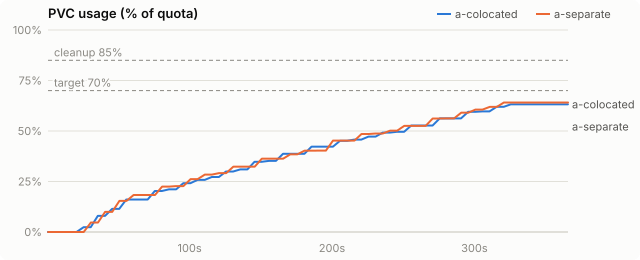
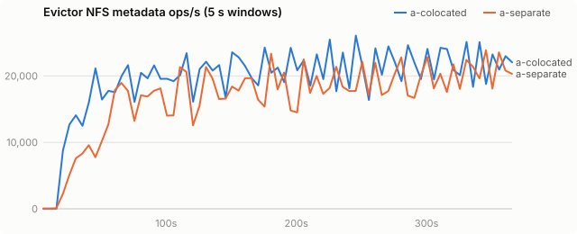
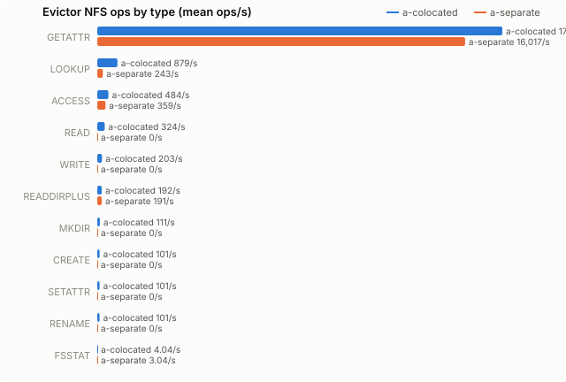
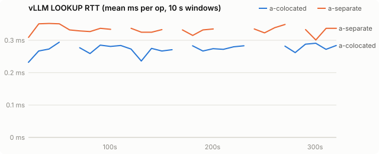
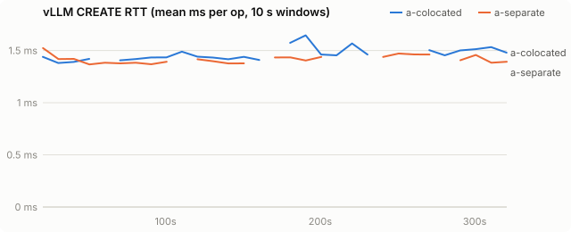
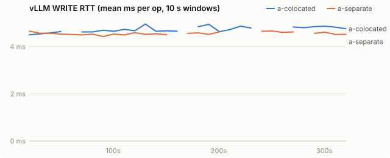
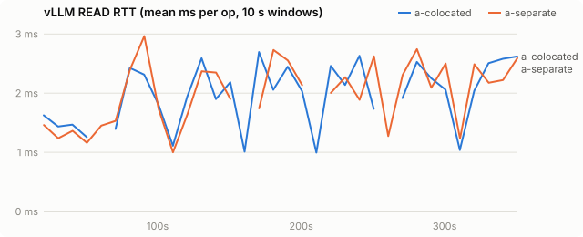
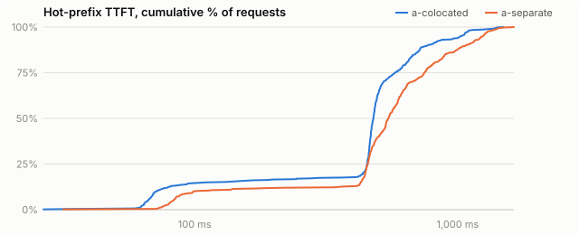

# Evictor placement: same node as vLLM vs another node

| run | evictor image |
|---|---|
| a-colocated | `quay.io/wseaton/pvc-evictor:a-f62b9a7` |
| a-separate | `quay.io/wseaton/pvc-evictor:a-f62b9a7` |

Does running the evictor on the same node as vLLM hurt vLLM? Variant **a** (the current Python evictor, the heaviest metadata load) for 5 minutes per placement on 2026-10-09, with PVCs mounted exactly like `shared-vast` (no `nosharecache`), so co-located pods share one NFS client. Pods landed on `gd91fda` / `gd91fda` (colocated) and `gd91fda` / `gff1776` (separate).

## Findings

| vLLM-side signal | colocated | separate |
|---|---|---|
| NFS client queue, WRITE / LOOKUP | 0.090 / 0.002 ms | 0.085 / 0.002 ms |
| FS-tier read time | 2.03 s/GiB | 2.10 s/GiB |
| FS-tier write time | 7.46 s/GiB | 7.41 s/GiB |
| hot-prefix TTFT p50 / p99 | 478 / 1,359 ms | 545 / 1,413 ms |
| vLLM load failures | 0 | 0 |

- **No measurable penalty.** Sharing one NFS client (`nconnect=32`) with an evictor issuing ~17k GETATTR/s added no client queueing to vLLM's ops, and vLLM's FS-tier read/write time per GiB is within 4%. The colocated run was faster on TTFT and churn throughput, which is most likely run-to-run variance on the shared backend (n = 1).
- **Counters merge.** Colocated, the vLLM pod's mountstats show 19.6k metadata ops/s: the evictor's traffic. With `shared-vast` mounts, per-pod NFS monitoring is impossible for pods on the same node. The RTT rows below are mixed for the colocated run and should be ignored there; the queue and FS-tier rows are not affected.
- Untested: NFS servers with fewer connections, several vLLM pods per node, longer runs.

## Setup

| setting | value |
|---|---|
| model | Qwen/Qwen3-0.6B |
| vLLM image | docker.io/vllm/vllm-openai:v0.31.0 |
| PVC size | 100Gi |
| storage class | kvreap-bench-vast-shared |
| load duration (s) | 300 |
| offload block (tokens) | 16 |
| CPU tier (bytes) | 2147483648 |
| GPU KV blocks | 4096 |
| churn prompt length | 4096 |
| churn concurrency | 8 |
| hot prefixes | 64 |
| hot prefix length | 2048 |
| hot request rate (req/s) | 2.0 |

Time axes are seconds since the load generator started.

## PVC usage

<picture><source media="(prefers-color-scheme: dark)" srcset="charts/usage-dark.svg"></picture>

## Evictor metadata load

<picture><source media="(prefers-color-scheme: dark)" srcset="charts/evictor-ops-dark.svg"></picture>

## Evictor ops by type

<picture><source media="(prefers-color-scheme: dark)" srcset="charts/evictor-op-types-dark.svg"></picture>

## vLLM LOOKUP latency

<picture><source media="(prefers-color-scheme: dark)" srcset="charts/rtt-lookup-dark.svg"></picture>

## vLLM CREATE latency

<picture><source media="(prefers-color-scheme: dark)" srcset="charts/rtt-create-dark.svg"></picture>

## vLLM WRITE latency

<picture><source media="(prefers-color-scheme: dark)" srcset="charts/rtt-write-dark.svg"></picture>

## vLLM READ latency

<picture><source media="(prefers-color-scheme: dark)" srcset="charts/rtt-read-dark.svg"></picture>

## Hot-prefix TTFT

<picture><source media="(prefers-color-scheme: dark)" srcset="charts/ttft-dark.svg"></picture>

## All metrics

| metric | a-colocated | a-separate |
|---|---|---|
| load duration (s) | 366 | 367 |
| **evictor metadata ops/s (mean)** | 19,611.6 | 16,812.4 |
| evictor metadata ops (total) | 7,158,237 | 6,153,339 |
| evictor ACCESS/s (mean / p95 10s) | 483.9 / 1,327.4 | 359.0 / 1,368.0 |
| evictor CREATE/s (mean / p95 10s) | 101.3 / 240.6 | 0.0 / 0.0 |
| evictor FSINFO/s (mean / p95 10s) | 0.0 / 0.0 | 0.0 / 0.0 |
| evictor FSSTAT/s (mean / p95 10s) | 4.0 / 4.2 | 3.0 / 3.1 |
| evictor GETATTR/s (mean / p95 10s) | 17,637.1 / 21,725.1 | 16,016.5 / 21,084.3 |
| evictor LINK/s (mean / p95 10s) | 0.0 / 0.0 | 0.0 / 0.0 |
| evictor LOOKUP/s (mean / p95 10s) | 879.3 / 2,179.0 | 242.5 / 2,401.4 |
| evictor MKDIR/s (mean / p95 10s) | 110.8 / 286.9 | 0.0 / 0.0 |
| evictor NULL/s (mean / p95 10s) | 0.0 / 0.0 | 0.0 / 0.0 |
| evictor PATHCONF/s (mean / p95 10s) | 0.0 / 0.0 | 0.0 / 0.0 |
| evictor READ/s (mean / p95 10s) | 323.6 / 626.8 | 0.0 / 0.0 |
| evictor READDIRPLUS/s (mean / p95 10s) | 192.4 / 466.1 | 191.3 / 494.1 |
| evictor READLINK/s (mean / p95 10s) | 0.0 / 0.0 | 0.0 / 0.0 |
| evictor REMOVE/s (mean / p95 10s) | 0.0 / 0.0 | 0.0 / 0.0 |
| evictor RENAME/s (mean / p95 10s) | 101.3 / 240.5 | 0.0 / 0.0 |
| evictor RMDIR/s (mean / p95 10s) | 0.0 / 0.0 | 0.0 / 0.0 |
| evictor SETATTR/s (mean / p95 10s) | 101.3 / 240.6 | 0.0 / 0.0 |
| evictor SYMLINK/s (mean / p95 10s) | 0.0 / 0.0 | 0.0 / 0.0 |
| evictor WRITE/s (mean / p95 10s) | 202.7 / 481.0 | 0.0 / 0.0 |
| vLLM LOOKUP RTT ms (all) | 0.28 | 0.34 |
| vLLM LOOKUP RTT ms (deleting / idle) | - / 0.28 | - / 0.34 |
| vLLM GETATTR RTT ms (all) | 0.25 | 0.39 |
| vLLM GETATTR RTT ms (deleting / idle) | - / 0.25 | - / 0.39 |
| vLLM CREATE RTT ms (all) | 1.45 | 1.41 |
| vLLM CREATE RTT ms (deleting / idle) | - / 1.45 | - / 1.41 |
| vLLM RENAME RTT ms (all) | 2.27 | 2.23 |
| vLLM RENAME RTT ms (deleting / idle) | - / 2.27 | - / 2.23 |
| vLLM WRITE RTT ms (all) | 4.69 | 4.57 |
| vLLM WRITE RTT ms (deleting / idle) | - / 4.69 | - / 4.57 |
| vLLM READ RTT ms (all) | 2.15 | 2.18 |
| vLLM READ RTT ms (deleting / idle) | - / 2.15 | - / 2.18 |
| vLLM LOOKUP client queue ms | 0.002 | 0.002 |
| vLLM GETATTR client queue ms | 0.002 | 0.003 |
| vLLM CREATE client queue ms | 0.002 | 0.001 |
| vLLM RENAME client queue ms | 0.009 | 0.009 |
| vLLM WRITE client queue ms | 0.090 | 0.085 |
| vLLM READ client queue ms | 0.009 | 0.008 |
| vLLM FS read s/GiB | 2.03 | 2.10 |
| vLLM FS write s/GiB | 7.46 | 7.41 |
| vLLM metadata ops/s | 19,609.7 | 1,980.0 |
| prune cycles | 0 | 0 |
| prune seconds (median) | - | - |
| max usage % | 63.2 | 64.1 |
| % time >= cleanup threshold | 0.0 | 0.0 |
| hot ttft p50 ms | 478.5 | 545.4 |
| hot ttft p90 ms | 765.7 | 1,073.4 |
| hot ttft p99 ms | 1,359.0 | 1,413.4 |
| hot requests (failed) | 448 (0) | 448 (0) |
| churn input tok/s | 48,629 | 38,999 |
| vLLM log: quota_exceeded | 0 | 0 |
| vLLM log: store_failed | 0 | 0 |
| vLLM log: load_failed | 0 | 0 |
| `vllm:external_prefix_cache_hits_total{engine="0",model_name="Qwen/Qwen3-0.6B"}` Δ | 621,920 | 642,720 |
| `vllm:external_prefix_cache_queries_total{engine="0",model_name="Qwen/Qwen3-0.6B"}` Δ | 4,601,863 | 4,339,719 |
| `vllm:kv_offload_allocation_failure_total{engine="0",model_name="Qwen/Qwen3-0.6B"}` Δ | 7,849 | 7,212 |
| `vllm:kv_offload_load_bytes_total{engine="0",model_name="Qwen/Qwen3-0.6B"}` Δ | 71,326,760,960 | 73,712,271,360 |
| `vllm:kv_offload_load_time_total{engine="0",model_name="Qwen/Qwen3-0.6B"}` Δ | 2 | 2 |
| `vllm:kv_offload_store_bytes_total{engine="0",model_name="Qwen/Qwen3-0.6B"}` Δ | 69,733,974,016 | 70,016,565,248 |
| `vllm:kv_offload_store_time_total{engine="0",model_name="Qwen/Qwen3-0.6B"}` Δ | 2 | 2 |
| `vllm:kv_offload_tiering_chunk_hits_total{engine="0",model_name="Qwen/Qwen3-0.6B",tier="1:fs"}` Δ | 40,942 | 42,297 |
| `vllm:kv_offload_tiering_chunk_queries_total{engine="0",model_name="Qwen/Qwen3-0.6B",tier="0:primary"}` Δ | 287,616 | 271,232 |
| `vllm:kv_offload_tiering_chunk_queries_total{engine="0",model_name="Qwen/Qwen3-0.6B",tier="1:fs"}` Δ | 41,936 | 43,229 |
| `vllm:kv_offload_tiering_promotion_allocation_failures_total{engine="0",model_name="Qwen/Qwen3-0.6B"}` Δ | 926 | 665 |
| `vllm:kv_offload_tiering_read_bytes_total{engine="0",model_name="Qwen/Qwen3-0.6B",tier="1:fs"}` Δ | 76,714,344,448 | 78,094,270,464 |
| `vllm:kv_offload_tiering_read_time_total{engine="0",model_name="Qwen/Qwen3-0.6B",tier="1:fs"}` Δ | 145 | 152 |
| `vllm:kv_offload_tiering_write_bytes_total{engine="0",model_name="Qwen/Qwen3-0.6B",tier="1:fs"}` Δ | 69,733,974,016 | 70,016,565,248 |
| `vllm:kv_offload_tiering_write_time_total{engine="0",model_name="Qwen/Qwen3-0.6B",tier="1:fs"}` Δ | 485 | 483 |
| `vllm:kv_offload_total_bytes_total{engine="0",model_name="Qwen/Qwen3-0.6B",transfer_type="CPU_to_GPU"}` Δ | 71,326,760,960 | 73,712,271,360 |
| `vllm:kv_offload_total_bytes_total{engine="0",model_name="Qwen/Qwen3-0.6B",transfer_type="GPU_to_CPU"}` Δ | 69,733,974,016 | 70,016,565,248 |
| `vllm:kv_offload_total_time_total{engine="0",model_name="Qwen/Qwen3-0.6B",transfer_type="CPU_to_GPU"}` Δ | 2 | 2 |
| `vllm:kv_offload_total_time_total{engine="0",model_name="Qwen/Qwen3-0.6B",transfer_type="GPU_to_CPU"}` Δ | 2 | 2 |
| `vllm:prefix_cache_queries_total{engine="0",model_name="Qwen/Qwen3-0.6B"}` Δ | 4,601,863 | 4,339,719 |
